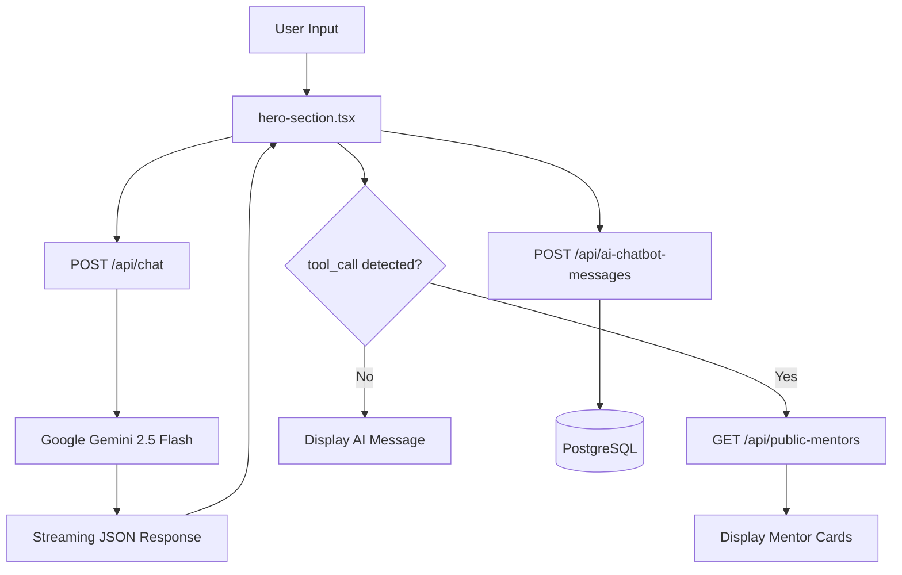
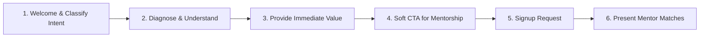
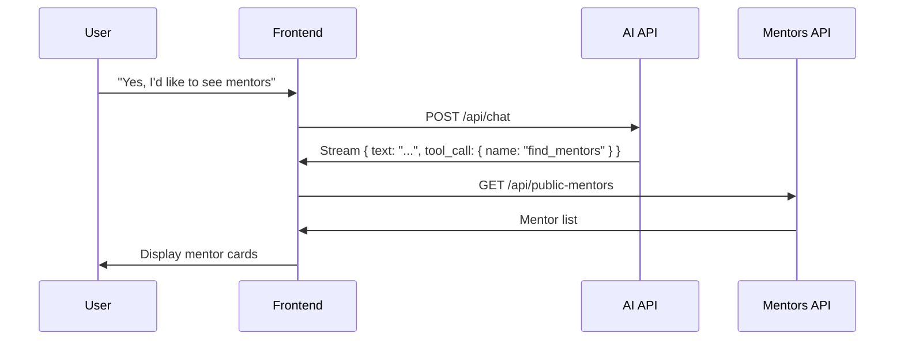

# AI Chatbot ("Aria") - Complete Technical Documentation

> **Last Updated:** January 2026  
> **Status:** Production  
> **Primary Location:** Landing Page Hero Section

---

## 1. Overview

The AI chatbot, named **"Aria,"** is a **mentorship concierge** designed to guide users toward mentor connections. It's not a general-purpose chatbot—it's a specialist that follows a carefully designed trust-building conversation flow.

### Key Features
- 🎯 **Goal-oriented conversations** - Guides users to mentor connections
- 🤝 **Trust-building funnel** - Provides value before pitching mentorship
- 🔧 **Tool-based architecture** - Uses `find_mentors` tool to display mentors
- ⚡ **Streaming responses** - Real-time typing effect for natural feel
- 📊 **Analytics tracking** - Logs all conversations and mentor exposures

---

## 2. Architecture Diagram



---

## 3. Tech Stack

| Component | Technology | Purpose |
|-----------|------------|---------|
| **AI Model** | Google Gemini 2.5 Flash | Language model for conversations |
| **AI SDK** | `@ai-sdk/google` + `ai` (Vercel) | Streaming and tool calling |
| **Schema Validation** | `zod` | Structured output validation |
| **Database** | PostgreSQL + Drizzle ORM | Message persistence and analytics |
| **Frontend** | React + Next.js 15 | UI components |
| **Styling** | Tailwind CSS + Design Tokens | Premium chat UI |

---

## 4. File Structure

```
📁 app/api/
├── 📁 chat/
│   └── route.ts                    # Main AI endpoint
├── 📁 ai-chatbot-messages/
│   └── route.ts                    # Message persistence
└── 📁 public-mentors/
    └── route.ts                    # Mentor fetching for tool

📁 components/landing/
└── hero-section.tsx                # Chat UI component (main)

📁 lib/db/schema/
├── ai-chatbot-messages.ts          # Message schema
└── ai-chatbot-message-insights.ts  # Analytics schema
```

---

## 5. API Reference

### 5.1 Chat Endpoint

**`POST /api/chat`**

Handles AI conversation with streaming responses.

**Request Body:**
```typescript
{
  userMessage: string;
  history: Array<{ type: 'user' | 'ai', content: string }>;
}
```

**Response:**
Streaming JSON with structured output:
```typescript
{
  text: string;              // AI response text
  tool_call?: {              // Optional tool invocation
    name: 'find_mentors';
    arguments: {
      query?: string;        // User's goal/query
    };
  };
}
```

**Implementation:** [route.ts](file:///c:/Users/Admin/young-minds-landing-page/app/api/chat/route.ts)

---

### 5.2 Message Persistence

**`POST /api/ai-chatbot-messages`**

Saves chat messages for analytics.

**Request Body:**
```typescript
{
  chatSessionId: string;       // UUID for session
  userId?: string;             // Optional (logged-in users)
  senderType: 'user' | 'ai' | 'system';
  content: string;
  responseToMessageId?: string;
  metadata?: Record<string, any>;
}
```

---

## 6. Database Schema

### 6.1 Messages Table

**`ai_chatbot_messages`**

| Column | Type | Description |
|--------|------|-------------|
| `id` | UUID | Primary key |
| `chat_session_id` | UUID | Groups messages by session |
| `user_id` | TEXT | References users (nullable) |
| `sender_type` | TEXT | 'user', 'ai', or 'system' |
| `content` | TEXT | Message content |
| `metadata` | JSON | Additional data (tool calls, etc.) |
| `ip_address` | TEXT | For anonymous users |
| `created_at` | TIMESTAMP | Auto-generated |

**Schema:** [ai-chatbot-messages.ts](file:///c:/Users/Admin/young-minds-landing-page/lib/db/schema/ai-chatbot-messages.ts)

---

### 6.2 Insights Table

**`ai_chatbot_message_insights`**

| Column | Type | Description |
|--------|------|-------------|
| `id` | UUID | Primary key |
| `message_id` | UUID | References message |
| `intent` | TEXT | Classified user intent |
| `question_text` | TEXT | Extracted question |
| `is_question` | BOOLEAN | Is this a question? |
| `universities` | TEXT[] | Mentioned universities |
| `frequency` | INTEGER | How often this is asked |
| `source` | TEXT | 'heuristic' or 'ai' |

**Schema:** [ai-chatbot-message-insights.ts](file:///c:/Users/Admin/young-minds-landing-page/lib/db/schema/ai-chatbot-message-insights.ts)

---

## 7. AI Persona & System Prompt

### 7.1 Identity

| Attribute | Value |
|-----------|-------|
| **Name** | Aria |
| **Role** | Personal Mentorship Guide / Concierge |
| **Tone** | Warm, friendly, encouraging, professional |
| **Model** | Google Gemini 2.5 Flash |
| **Temperature** | 0.7 |
| **Max Tokens** | 1024 |

### 7.2 Trust-Building Funnel

Aria follows a **sequential trust-building process**:



1. **Welcome & Classify** - Greeting + identify user persona
2. **Diagnose & Understand** - 1-2 targeted questions
3. **Provide Value** - Mini-solution (checklist, roadmap, etc.)
4. **Soft CTA** - "Would you like to speak to someone who's been in your shoes?"
5. **Signup Request** - Gate mentor access
6. **Present Matches** - Trigger `find_mentors` tool

### 7.3 User Personas

| Persona | Triggers | Example Mini-Solution |
|---------|----------|----------------------|
| **Student** | "student", "B.Tech", "placements" | Career Roadmap PDF |
| **Professional** | "career change", "upskill" | 30-Day Transition Plan |
| **Founder** | "startup", "vendor", "investor" | Vendor Selection Checklist |
| **Explorer** | "just browsing", "not sure" | Quick discovery quiz |

---

## 8. Tool System

### 8.1 Available Tools

| Tool | Purpose | When Used |
|------|---------|-----------|
| `find_mentors` | Fetch and display mentors | After user agrees to soft CTA |

### 8.2 Tool Call Flow



### 8.3 Adding New Tools

**Step 1: Update API schema** (`app/api/chat/route.ts`)
```typescript
schema: z.object({
  text: z.string(),
  tool_call: z.union([
    z.object({ name: z.literal('find_mentors'), arguments: z.object({...}) }),
    z.object({ name: z.literal('your_new_tool'), arguments: z.object({...}) }),
  ]).optional()
})
```

**Step 2: Update system prompt** - Explain when/how to use the tool

**Step 3: Handle in frontend** (`hero-section.tsx`)
```typescript
if (toolName === 'your_new_tool') {
  await executeYourTool(toolArgs);
}
```

---

## 9. Frontend Implementation

### 9.1 Component Location

**Primary:** [hero-section.tsx](file:///c:/Users/Admin/young-minds-landing-page/components/landing/hero-section.tsx)

### 9.2 Key State Variables

```typescript
const [isChatExpanded, setIsChatExpanded] = useState(false);
const [messages, setMessages] = useState<Message[]>([]);
const [isAiTyping, setIsAiTyping] = useState(false);
const [currentAiMessage, setCurrentAiMessage] = useState("");
const [showMentors, setShowMentors] = useState(false);
const [dbMentors, setDbMentors] = useState<DbMentor[]>([]);
```

### 9.3 Streaming Response Handling

```typescript
const reader = res.body.getReader();
const decoder = new TextDecoder();
let partialJson = "";

while (true) {
  const { done, value } = await reader.read();
  if (done) break;
  
  partialJson += decoder.decode(value, { stream: true });
  
  // Extract text for real-time display
  const textMatch = partialJson.match(/"text"\s*:\s*"((?:[^"\\]|\\.)*)"/);
  if (textMatch) {
    setCurrentAiMessage(textMatch[1].replace(/\\n/g, "\n"));
  }
  
  // Check for tool call
  try {
    const parsed = JSON.parse(partialJson);
    if (parsed.tool_call?.name === 'find_mentors') {
      toolCallDetected = true;
    }
  } catch (e) { /* JSON incomplete */ }
}
```

### 9.4 Auto-Scroll Behavior

When chat expands, it automatically scrolls into view:

```typescript
useEffect(() => {
  if (isChatExpanded && chatContainerRef.current) {
    setTimeout(() => {
      chatContainerRef.current?.scrollIntoView({ 
        behavior: 'smooth', 
        block: 'center' 
      });
    }, 100);
  }
}, [isChatExpanded]);
```

---

## 10. UI Design System

### 10.1 Chat Container

| State | Shadow | Ring | Scale |
|-------|--------|------|-------|
| Default | `shadow-small` | - | 1.0 |
| Hovered | `shadow-medium` | - | 1.005 |
| Focused | `shadow-large` | `ring-primary/20` | 1.01 |

### 10.2 Message Bubbles

| Type | Background | Corner Style |
|------|------------|--------------|
| User (sent) | `bg-primary` | `rounded-br-md` |
| AI (received) | `bg-secondary` | `rounded-bl-md` |
| Both | `shadow-subtle` | `rounded-2xl` |

### 10.3 Header & Input

- Header: `bg-card/80 backdrop-blur-sm`
- Input: `bg-secondary rounded-xl shadow-subtle`
- Send button: `bg-primary rounded-xl` (active) / `bg-muted` (disabled)

### 10.4 AI Avatar

```tsx
<div className="w-9 h-9 rounded-full bg-gradient-to-br from-primary to-primary/70 
               flex items-center justify-center shadow-sm ring-2 ring-background">
  <Bot className="w-4 h-4 text-white" />
</div>
```

---

## 11. Session Management

### 11.1 Session ID Generation

```typescript
useEffect(() => {
  let sessionId = localStorage.getItem('ai_chatbot_session_id');
  if (!sessionId) {
    sessionId = uuidv4();
    localStorage.setItem('ai_chatbot_session_id', sessionId);
  }
  setChatSessionId(sessionId);
}, []);
```

### 11.2 Analytics Events Logged

| Event | Metadata |
|-------|----------|
| User message | `content`, `timestamp` |
| AI response | `content`, `responseToMessageId` |
| Mentors shown | `eventType: 'mentors_shown'`, `mentorIds[]` |

---

## 12. Environment Variables

| Variable | Required | Description |
|----------|----------|-------------|
| `GOOGLE_GENERATIVE_AI_API_KEY` | ✅ Yes | Google AI API key |

---

## 13. Error Handling

| Scenario | Response |
|----------|----------|
| Missing API key | 500: "Server is missing GOOGLE_GENERATIVE_AI_API_KEY" |
| AI stream error | Display: "Sorry, I could not get a response right now." |
| Mentor fetch fails | Display: "I couldn't load mentors right now. Please try again." |

---

## 14. Future Enhancements

- [ ] `get_resource` tool - Fetch mini-solutions (PDFs, checklists)
- [ ] `trigger_signup_ui` tool - Programmatic signup flow
- [ ] Intent classification analytics (via AI)
- [ ] Conversation summaries for mentor context
- [ ] Voice input/output integration

---

## 15. Related Files

| File | Purpose |
|------|---------|
| [hero-section.tsx](file:///c:/Users/Admin/young-minds-landing-page/components/landing/hero-section.tsx) | Main chat UI |
| [route.ts (chat)](file:///c:/Users/Admin/young-minds-landing-page/app/api/chat/route.ts) | AI API endpoint |
| [ai-chatbot-messages.ts](file:///c:/Users/Admin/young-minds-landing-page/lib/db/schema/ai-chatbot-messages.ts) | Message schema |
| [ai-chatbot-message-insights.ts](file:///c:/Users/Admin/young-minds-landing-page/lib/db/schema/ai-chatbot-message-insights.ts) | Insights schema |
| [message-thread.tsx](file:///c:/Users/Admin/young-minds-landing-page/components/messaging/message-thread.tsx) | Dashboard messaging (uses similar patterns) |
