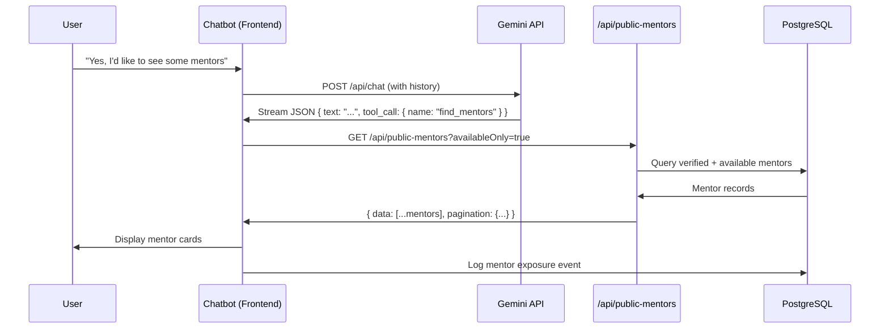

# AI Mentor Suggestion System

> **Related Documentation:** [AI Chatbot Aria](file:///c:/Users/Admin/young-minds-landing-page/documentation/ai-chatbot-aria.md)  
> **Last Updated:** January 2026

---

## 1. Overview

The AI Mentor Suggestion System is the core mechanism by which the Aria chatbot connects users with mentors. When a user expresses interest in mentorship, the AI autonomously decides to invoke the `find_mentors` tool, which triggers a mentor search and displays recommendation cards.



---

## 2. The `find_mentors` Tool

### 2.1 Tool Definition (Backend)

**Location:** [app/api/chat/route.ts](file:///c:/Users/Admin/young-minds-landing-page/app/api/chat/route.ts)

```typescript
schema: z.object({
  text: z.string().describe('The response text to the user.'),
  tool_call: z
    .object({
      name: z.literal('find_mentors'),
      arguments: z.object({
        query: z.string().optional().describe("The user's primary goal or query."),
      }),
    })
    .optional()
    .describe('The tool to call to find and display mentors to the user.'),
})
```

### 2.2 When Does the AI Call This Tool?

The AI is instructed in the system prompt to call `find_mentors` only after:

1. ✅ Understanding the user's intent (student, professional, founder, etc.)
2. ✅ Asking 1-2 clarifying questions
3. ✅ Providing a "mini-solution" (value before pitch)
4. ✅ User agreeing to the soft CTA ("Would you like to speak to someone...")

**Example Trigger Flow:**
```
User: "I want to switch from marketing to product management."
AI:   (Provides 3-step transition plan)
AI:   "Would you like to speak to someone who's been in your shoes?"
User: "Yes, that would be great!"
AI:   "Perfect! Based on your goal, I'm finding a few mentors..."
      → AI includes tool_call: { name: "find_mentors" } in response
```

### 2.3 Tool Detection (Frontend)

**Location:** [hero-section.tsx](file:///c:/Users/Admin/young-minds-landing-page/components/landing/hero-section.tsx) (lines 234-238)

```typescript
// During streaming, check if tool_call is present
const finalJson = JSON.parse(partialJson);
if (finalJson.tool_call && finalJson.tool_call.name === 'find_mentors') {
  toolCallDetected = true;
}
```

After the stream completes:
```typescript
if (toolCallDetected) {
  const mentors = await fetchMentorsFromApi();
  if (mentors && mentors.length) {
    await logMentorExposure(mentors.map((mentor) => mentor.id));
  }
}
```

---

## 3. Mentor Fetching API

### 3.1 Endpoint

**`GET /api/public-mentors`**

**Location:** [app/api/public-mentors/route.ts](file:///c:/Users/Admin/young-minds-landing-page/app/api/public-mentors/route.ts)

### 3.2 Query Parameters

| Parameter | Default | Description |
|-----------|---------|-------------|
| `page` | 1 | Page number for pagination |
| `pageSize` | 12 | Mentors per page (max 50) |
| `availableOnly` | true | Only show available mentors |
| `q` | "" | Search by name, title, or company |
| `industry` | "" | Filter by industry |

### 3.3 Filtering Logic

The API applies these filters:

```typescript
// Required: Only verified mentors
eq(mentors.verificationStatus, 'VERIFIED')

// Optional: Only available
if (availableOnly) eq(mentors.isAvailable, true)

// Optional: Industry filter
if (industry) ilike(mentors.industry, `%${industry}%`)

// Optional: Search query
if (q) {
  or(
    ilike(users.name, `%${q}%`),
    ilike(mentors.title, `%${q}%`),
    ilike(mentors.company, `%${q}%`)
  )
}
```

### 3.4 Response Schema

```typescript
{
  success: true,
  data: [
    {
      id: string,           // Mentor ID
      userId: string,       // User account ID
      name: string,         // Display name
      email: string,        // Email
      image: string | null, // Profile image URL
      title: string,        // Job title
      company: string,      // Company name
      industry: string,     // Industry/field
      expertise: string,    // Comma-separated skills
      experience: number,   // Years of experience
      hourlyRate: string,   // Session rate
      currency: string,     // Currency code
      headline: string,     // Short bio
      about: string,        // Full bio
      linkedinUrl: string,  // LinkedIn profile
      githubUrl: string,    // GitHub profile
      websiteUrl: string,   // Personal website
      verificationStatus: 'VERIFIED',
      isAvailable: boolean
    }
  ],
  pagination: {
    page: number,
    pageSize: number,
    hasMore: boolean
  }
}
```

---

## 4. Mentor Card Display

### 4.1 Frontend Call

**Location:** [hero-section.tsx](file:///c:/Users/Admin/young-minds-landing-page/components/landing/hero-section.tsx) (lines 287-320)

```typescript
const fetchMentorsFromApi = async (): Promise<DbMentor[] | null> => {
  setIsSearchingMentors(true);
  
  const params = new URLSearchParams({
    page: '1',
    pageSize: '12',
    availableOnly: 'true',
  });

  const res = await fetch(`/api/public-mentors?${params.toString()}`);
  const json = await res.json();
  const list: DbMentor[] = json?.data ?? [];
  
  setDbMentors(list);
  setShowMentors(true);
  setCurrentMentorIndex(0);
  
  return list;
};
```

### 4.2 Card Content

Each mentor card displays:

| Element | Source Field | Fallback |
|---------|--------------|----------|
| **Profile Image** | `image` | Generated initials SVG |
| **Name** | `name` | "Unnamed Mentor" |
| **Title** | `title` + `company` | "Mentor" |
| **Headline** | `headline` | (hidden if empty) |
| **Expertise Tags** | `expertise` (parsed, max 4) | (hidden if empty) |
| **Experience** | `experience` | 0 yrs |
| **Rate** | `currency` + `hourlyRate` | "—" |
| **Industry** | `industry` | "—" |
| **Social Links** | `linkedinUrl`, `websiteUrl` | (hidden if empty) |

### 4.3 Pagination

- Shows 3 mentors at a time in a grid
- Navigation buttons: Previous / Next
- Cycles through all fetched mentors (up to 12)

```typescript
const visibleMentors = dbMentors.slice(currentMentorIndex, currentMentorIndex + 3);
const canGoNext = currentMentorIndex + 3 < dbMentors.length;
const canGoPrev = currentMentorIndex > 0;
```

---

## 5. Analytics & Logging

### 5.1 Mentor Exposure Logging

When mentors are shown, the system logs this event:

```typescript
const logMentorExposure = async (mentorIds: string[]) => {
  await saveMessageToDB('system', 'Mentor recommendations shown', null, {
    eventType: 'mentors_shown',
    mentorIds,
  });
};
```

**Database Record:**
- `senderType`: 'system'
- `content`: 'Mentor recommendations shown'
- `metadata`: `{ eventType: 'mentors_shown', mentorIds: [...] }`

### 5.2 Analytics Queries

These exposure events can be queried to answer:
- Which mentors are being shown most frequently?
- What user intents lead to mentor suggestions?
- Conversion rate from mentor display to booking

---

## 6. User Actions

### 6.1 Clicking a Mentor Card

When a user clicks on a mentor card:

```typescript
const handleBookIntroCall = (mentorId: string) => {
  if (!isAuthenticated) {
    setShowSignInPopup(true);
    return;
  }
  router.push(`/dashboard?section=explore&mentor=${mentorId}`);
};
```

**Flow:**
1. If not logged in → Show sign-in popup
2. If logged in → Redirect to explore section with mentor pre-selected

---

## 7. Data Flow Summary

```
┌─────────────────────────────────────────────────────────────────────────┐
│                         AI MENTOR SUGGESTION FLOW                        │
└─────────────────────────────────────────────────────────────────────────┘

1. CONVERSATION
   User chats with Aria → AI builds trust → User agrees to see mentors

2. TOOL CALL
   AI response includes: { tool_call: { name: "find_mentors" } }

3. API REQUEST
   Frontend calls: GET /api/public-mentors?availableOnly=true&pageSize=12

4. DATABASE QUERY
   SELECT mentors WHERE verificationStatus = 'VERIFIED' AND isAvailable = true
   ORDER BY createdAt DESC
   LIMIT 12

5. DISPLAY
   Frontend renders mentor cards in 3-column grid with pagination

6. LOGGING
   Mentor IDs logged to ai_chatbot_messages with eventType: 'mentors_shown'

7. USER ACTION
   Click card → Auth check → Redirect to booking flow
```

---

## 10. Known Issues & Enhancement Plan

### 10.1 Broken Profile Images in Mentor Cards

**Status:** 🔴 Bug

**Screenshot:**


**Root Cause Analysis:**

The API returns `users.image` but mentors upload their profile pictures to `mentors.profileImageUrl`:

```typescript
// Current API (app/api/public-mentors/route.ts line 62)
image: users.image,  // ❌ This is the OAuth profile pic (often empty)

// Mentor schema has (lib/db/schema/mentors.ts line 47)
profileImageUrl: text('profile_image_url'),  // ✅ This is where mentors upload
```

**Frontend fallback logic:**
```typescript
// hero-section.tsx line 727
const imgSrc = m.image || placeholderDataUrl(m.name)
// Uses users.image, which is often null/empty for email signups
```

**Proposed Fix:**

1. **API Change** - Add `profileImageUrl` to the SELECT and use it with fallback:
```typescript
.select({
  // ... existing fields
  image: users.image,
  profileImageUrl: mentors.profileImageUrl,  // ADD THIS
})
```

2. **Frontend Change** - Prioritize `profileImageUrl`:
```typescript
const imgSrc = m.profileImageUrl || m.image || placeholderDataUrl(m.name)
```

---

### 10.2 Mentor Profile Popup - Poor Modal Formatting

**Status:** 🔴 UX Issue

**Screenshots:**

````carousel

<!-- slide -->

````

**Root Cause Analysis:**

The `MentorDetailView` component ([mentor-detail-view.tsx](file:///c:/Users/Admin/young-minds-landing-page/components/mentee/mentor-detail-view.tsx)) is designed as a **full-page layout** with:
- Full-width hero banner (`h-64 md:h-80`)
- Max-width container (`max-w-7xl`)
- 12-column grid layout
- Sticky sidebar

But it's being rendered inside a **modal/popup** context, causing:
- Oversized hero banner
- Content overflow
- Sidebar cut off
- Scrolling issues

**Current Layout:**
```
┌─────────────────────────────────────────────────────────────────┐
│  FULL-WIDTH HERO BANNER (h-64 to h-80)                          │
├─────────────────────────────────────────────────────────────────┤
│  ┌───────────────────────────────────┬─────────────────────┐    │
│  │  LEFT COLUMN (8/12)               │  RIGHT SIDEBAR (4/12)│    │
│  │  - Tabs                           │  - Stats             │    │
│  │  - Overview                       │  - Booking Card      │    │
│  │  - Reviews                        │                      │    │
│  │  - Achievements                   │                      │    │
│  └───────────────────────────────────┴─────────────────────┘    │
└─────────────────────────────────────────────────────────────────┘
```

**Proposed Fixes:**

#### Option A: Create Modal-Specific Variant (Recommended)
Create `MentorDetailModal.tsx` with:
- Compact header (no full-width banner)
- Single-column layout for modal
- Simplified tabs or accordion
- Inline booking card at bottom

#### Option B: Add `variant` Prop
Add `variant: 'page' | 'modal'` prop to conditionally render layouts:
```tsx
export function MentorDetailView({ mentorId, onBack, variant = 'page' }: Props) {
  if (variant === 'modal') {
    return <CompactModalLayout mentor={mentor} />
  }
  return <FullPageLayout mentor={mentor} />
}
```

#### Option C: Responsive Modal Sizing
Make the modal larger (`max-w-4xl`) and style the component to work within it.

---

### 10.3 Enhancement Roadmap

| Priority | Issue | Effort | Impact |
|----------|-------|--------|--------|
| 🔴 High | Fix profile image API | 30 min | High |
| 🔴 High | Modal-friendly mentor view | 2-3 hrs | High |
| 🟡 Medium | Add `profileImageUrl` to card display | 15 min | Medium |
| 🟡 Medium | Lazy-load mentor data in modal | 1 hr | Medium |
| 🟢 Low | Add skeleton loading to modal | 30 min | Low |

---

## 11. Future Enhancements

| Enhancement | Description |
|-------------|-------------|
| **Personalized Ranking** | Use user's stated goals to rank mentors by relevance |
| **AI-Powered Matching** | Pass user profile to API for semantic matching |
| **Industry Filtering** | Use tool arguments to filter by detected industry |
| **Availability Slots** | Show next available time slot on card |
| **Ratings Display** | Add mentor ratings when review system is built |

---

## 12. Key Files Reference


| File | Purpose |
|------|---------|
| [app/api/chat/route.ts](file:///c:/Users/Admin/young-minds-landing-page/app/api/chat/route.ts) | AI endpoint with tool schema |
| [app/api/public-mentors/route.ts](file:///c:/Users/Admin/young-minds-landing-page/app/api/public-mentors/route.ts) | Mentor fetching API |
| [hero-section.tsx](file:///c:/Users/Admin/young-minds-landing-page/components/landing/hero-section.tsx) | Chat UI + mentor cards |
| [lib/db/schema/mentors.ts](file:///c:/Users/Admin/young-minds-landing-page/lib/db/schema/mentors.ts) | Mentor database schema |
| [lib/db/schema/ai-chatbot-messages.ts](file:///c:/Users/Admin/young-minds-landing-page/lib/db/schema/ai-chatbot-messages.ts) | Message logging schema |
