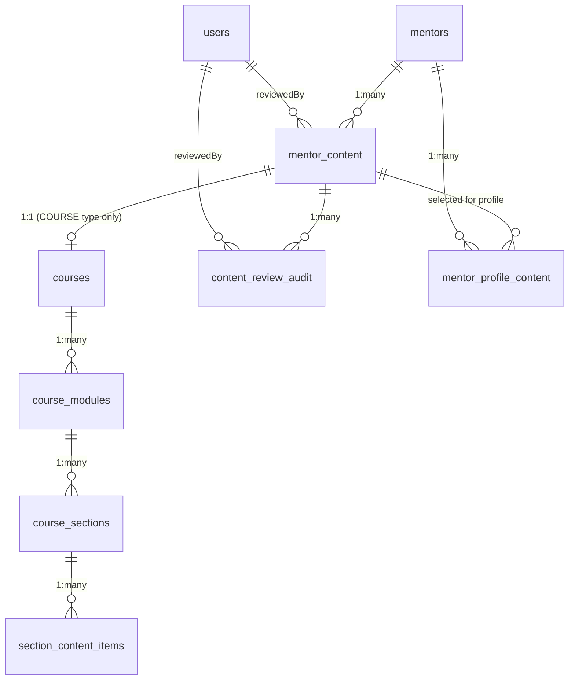
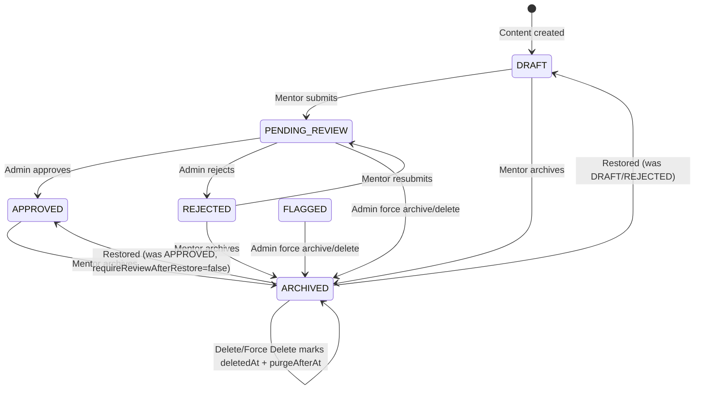

# Mentor Content Module — Complete Low-Level Documentation

> **Scope**: Every file, function, API route, database table, component, hook, and utility that powers the **My Content** section of the mentor dashboard. Written for developers who will maintain, extend, or debug this module.
>
> **Last Updated**: 2026-03-17 (Phase 2 implemented: retention-aware soft delete + purge + storage cleanup hooks)
>
> **Current Runtime Note**: App-internal content operations now run through `lib/content/server/service.ts` and `lib/trpc/routers/content.ts`. The route inventory below is historical context for how the module evolved; public content and uploads still use normal HTTP routes.

---

## Table of Contents

1. [File Inventory](#1-file-inventory)
2. [Database Schema (Low-Level)](#2-database-schema-low-level)
3. [API Routes — Full Reference](#3-api-routes--full-reference)
4. [React Query Hooks](#4-react-query-hooks)
5. [Frontend Components — Deep Dive](#5-frontend-components--deep-dive)
6. [Utility Files](#6-utility-files)
7. [Authorization & Guards](#7-authorization--guards)
8. [Storage & File Upload](#8-storage--file-upload)
9. [Error Handling](#9-error-handling)
10. [Drag-and-Drop Reordering](#10-drag-and-drop-reordering)
11. [Data Flow Diagrams](#11-data-flow-diagrams)
12. [Content Review & Publication Workflow](#12-content-review--publication-workflow)
13. [Known Quirks & Design Notes](#13-known-quirks--design-notes)

---

## 1. File Inventory

### Frontend Components (16 files)
| File | Lines | Purpose |
|---|---|---|
| [content.tsx](file:///c:/Users/Admin/young-minds-landing-page/components/mentor/content/content.tsx) | ~330 | Main orchestrator — tabs (all/pending/approved/rejected/archived), card grid with review workflow actions, dialog controllers |
| [profile-content-selector.tsx](file:///c:/Users/Admin/young-minds-landing-page/components/mentor/content/profile-content-selector.tsx) | ~205 | Checklist for mentors to select approved content for public profile display |
| [admin-content.tsx](file:///c:/Users/Admin/young-minds-landing-page/components/admin/dashboard/admin-content.tsx) | ~530 | Admin content management console — stats cards, 7 status tabs (including DRAFT/FLAGGED), search/type filters, expandable rows, and full suite of administrative actions (Approve, Reject, Flag, Force Delete, etc.) |
| [mentor-profile-content.tsx](file:///c:/Users/Admin/young-minds-landing-page/components/mentor/dashboard/mentor-profile-content.tsx) | ~150 | Mentee-facing content cards on mentor profile (fetches from public API) |
| [create-content-dialog.tsx](file:///c:/Users/Admin/young-minds-landing-page/components/mentor/content/create-content-dialog.tsx) | 744 | Multi-step wizard for creating COURSE / FILE / URL content |
| [edit-content-dialog.tsx](file:///c:/Users/Admin/young-minds-landing-page/components/mentor/content/edit-content-dialog.tsx) | 609 | Tabbed editor with auto-save (Details / Media / Analytics) |
| [course-builder.tsx](file:///c:/Users/Admin/young-minds-landing-page/components/mentor/content/course-builder.tsx) | 384 | Full-page course management with modules/sections/items |
| [create-course-dialog.tsx](file:///c:/Users/Admin/young-minds-landing-page/components/mentor/content/create-course-dialog.tsx) | 819 | 4-tab course metadata form (Basic/Pricing/Content/Advanced) |
| [create-module-dialog.tsx](file:///c:/Users/Admin/young-minds-landing-page/components/mentor/content/create-module-dialog.tsx) | 341 | Module creation with 4 premade templates |
| [create-section-dialog.tsx](file:///c:/Users/Admin/young-minds-landing-page/components/mentor/content/create-section-dialog.tsx) | 592 | 3-tab section creator (Template / Details / Content Structure) |
| [create-content-item-dialog.tsx](file:///c:/Users/Admin/young-minds-landing-page/components/mentor/content/create-content-item-dialog.tsx) | 723 | 3-tab content item wizard with file upload + progress bar |
| [edit-item-dialog.tsx](file:///c:/Users/Admin/young-minds-landing-page/components/mentor/content/edit-item-dialog.tsx) | 240 | Polymorphic editor for modules, sections, and content items |
| [reorderable-modules.tsx](file:///c:/Users/Admin/young-minds-landing-page/components/mentor/content/reorderable-modules.tsx) | 435 | Drag-and-drop module list using @dnd-kit |
| [mentor-content-error-boundary.tsx](file:///c:/Users/Admin/young-minds-landing-page/components/mentor/content/mentor-content-error-boundary.tsx) | 221 | Context-specific React error boundary + error hook |
| [course-structure-skeleton.tsx](file:///c:/Users/Admin/young-minds-landing-page/components/mentor/content/course-structure-skeleton.tsx) | 115 | Loading skeletons for course structure and details tabs |
| [video-preview-dialog.tsx](file:///c:/Users/Admin/young-minds-landing-page/components/mentor/content/video-preview-dialog.tsx) | 87 | Video playback dialog using custom VideoPlayer component |

### API Routes (16 route files)
| File | Methods | Purpose |
|---|---|---|
| [content/route.ts](file:///c:/Users/Admin/young-minds-landing-page/app/api/mentors/content/route.ts) | GET, POST | List all / create content |
| [content/[id]/route.ts](file:///c:/Users/Admin/young-minds-landing-page/app/api/mentors/content/%5Bid%5D/route.ts) | GET, PUT, DELETE | Single content CRUD |
| [content/[id]/submit-review/route.ts](file:///c:/Users/Admin/young-minds-landing-page/app/api/mentors/content/%5Bid%5D/submit-review/route.ts) | POST | **NEW** — Submit content for admin review |
| [content/[id]/course/route.ts](file:///c:/Users/Admin/young-minds-landing-page/app/api/mentors/content/%5Bid%5D/course/route.ts) | POST, PUT | Course metadata setup/update |
| [content/[id]/course/modules/route.ts](file:///c:/Users/Admin/young-minds-landing-page/app/api/mentors/content/%5Bid%5D/course/modules/route.ts) | GET, POST | List / create modules |
| [content/[id]/course/modules/[moduleId]/route.ts](file:///c:/Users/Admin/young-minds-landing-page/app/api/mentors/content/%5Bid%5D/course/modules/%5BmoduleId%5D/route.ts) | GET, PUT, DELETE | Single module CRUD |
| [content/modules/[moduleId]/sections/route.ts](file:///c:/Users/Admin/young-minds-landing-page/app/api/mentors/content/modules/%5BmoduleId%5D/sections/route.ts) | GET, POST | List / create sections |
| [content/modules/[moduleId]/sections/[sectionId]/route.ts](file:///c:/Users/Admin/young-minds-landing-page/app/api/mentors/content/modules/%5BmoduleId%5D/sections/%5BsectionId%5D/route.ts) | GET, PUT, DELETE | Single section CRUD |
| [content/sections/[sectionId]/content-items/route.ts](file:///c:/Users/Admin/young-minds-landing-page/app/api/mentors/content/sections/%5BsectionId%5D/content-items/route.ts) | GET, POST | List / create content items |
| [content/sections/[sectionId]/content-items/[itemId]/route.ts](file:///c:/Users/Admin/young-minds-landing-page/app/api/mentors/content/sections/%5BsectionId%5D/content-items/%5BitemId%5D/route.ts) | GET, PUT, DELETE | Single content item CRUD |
| [content/upload/route.ts](file:///c:/Users/Admin/young-minds-landing-page/app/api/mentors/content/upload/route.ts) | POST | Content file uploads (also [upload/route.ts](file:///c:/Users/Admin/young-minds-landing-page/app/api/upload/route.ts)) |
| [profile-content/route.ts](file:///c:/Users/Admin/young-minds-landing-page/app/api/mentors/profile-content/route.ts) | GET, PUT | **NEW** — Mentor profile content selection CRUD |
| [[id]/public-content/route.ts](file:///c:/Users/Admin/young-minds-landing-page/app/api/mentors/%5Bid%5D/public-content/route.ts) | GET | **NEW** — Public endpoint for mentee-facing profile content |
| [admin/content/route.ts](file:///c:/Users/Admin/young-minds-landing-page/app/api/admin/content/route.ts) | GET | **NEW** — Admin: list all content (paginated, filtered) |
| [admin/content/[id]/route.ts](file:///c:/Users/Admin/young-minds-landing-page/app/api/admin/content/%5Bid%5D/route.ts) | GET | **NEW** — Admin: single content detail + audit history |
| [admin/content/[id]/review/route.ts](file:///c:/Users/Admin/young-minds-landing-page/app/api/admin/content/%5Bid%5D/review/route.ts) | POST | **NEW** — Admin: approve/reject content |

### Hooks, Schema, and Utilities
| File | Purpose |
|---|---|
| [use-content-queries.ts](file:///c:/Users/Admin/young-minds-landing-page/hooks/queries/use-content-queries.ts) | All React Query hooks for content + TS interfaces |
| [mentor-content.ts](file:///c:/Users/Admin/young-minds-landing-page/lib/db/schema/mentor-content.ts) | Drizzle schema: 7 tables, 5 enums, relations, types |
| [safe-json.ts](file:///c:/Users/Admin/young-minds-landing-page/lib/utils/safe-json.ts) | Safe JSON parse/stringify for stored arrays |
| [guards.ts](file:///c:/Users/Admin/young-minds-landing-page/lib/api/guards.ts) | `requireMentor()` auth guard used by newer routes |
| `lib/storage.ts` | `upload()`, `resolveStorageUrl()`, `normalizeStorageValue()` |
| `lib/api/mentor-content.ts` | `getMentorForContent()`, `getMentorContentOwnershipCondition()` |

---

## 2. Database Schema (Low-Level)

**File**: [mentor-content.ts](file:///c:/Users/Admin/young-minds-landing-page/lib/db/schema/mentor-content.ts)

### 2.1 Enums

```typescript
pgEnum('content_type',           ['COURSE', 'FILE', 'URL'])
pgEnum('content_item_type',      ['VIDEO', 'PDF', 'DOCUMENT', 'URL', 'TEXT'])
pgEnum('course_difficulty',      ['BEGINNER', 'INTERMEDIATE', 'ADVANCED'])
pgEnum('content_status',         ['DRAFT', 'PENDING_REVIEW', 'APPROVED', 'REJECTED', 'ARCHIVED', 'FLAGGED'])
pgEnum('content_review_action',  ['SUBMITTED', 'APPROVED', 'REJECTED', 'RESUBMITTED', 'ARCHIVED', 'RESTORED', 'FLAGGED', 'UNFLAGGED', 'FORCE_APPROVED', 'FORCE_ARCHIVED', 'APPROVAL_REVOKED', 'FORCE_DELETED'])
```

> [!IMPORTANT]
> `PUBLISHED` was the old status value. All existing `PUBLISHED` rows must be migrated to `APPROVED`. The code no longer references `PUBLISHED`.

### 2.2 Entity Relationship



### 2.3 Table: `mentor_content`

The root table for all content types. Type-specific columns are nullable. `mentor_id` is nullable to support platform-owned content (`owner_type = PLATFORM`) created by admins.

| Column | Type | Nullable | Notes |
|---|---|---|---|
| `id` | uuid PK | No | `defaultRandom()` |
| `mentor_id` | uuid FK -> `mentors.id` | Yes | Mentor owner for mentor-created content (`onDelete: 'cascade'`) |
| `title` | text | No | |
| `description` | text | Yes | |
| `type` | `content_type` enum | No | `COURSE` / `FILE` / `URL` |
| `status` | `content_status` enum | No | Default: `DRAFT` |
| `file_url` | text | Yes | FILE type: Supabase Storage URL |
| `file_name` | text | Yes | FILE type: original filename |
| `file_size` | integer | Yes | FILE type: bytes |
| `mime_type` | text | Yes | FILE type: e.g. `application/pdf` |
| `url` | text | Yes | URL type: the external link |
| `url_title` | text | Yes | URL type: display title |
| `url_description` | text | Yes | URL type: display description |
| `submitted_for_review_at` | timestamp | Yes | **NEW** - When content was last submitted for review |
| `reviewed_at` | timestamp | Yes | **NEW** - When admin last reviewed |
| `reviewed_by` | text FK -> `users.id` | Yes | **NEW** - Admin user who reviewed (`onDelete: 'set null'`) |
| `review_note` | text | Yes | **NEW** - Admin feedback (especially for rejections) |
| `flag_reason` | text | Yes | **NEW** - Reason content was flagged for a policy violation |
| `flagged_at` | timestamp | Yes | **NEW** - When content was flagged |
| `flagged_by` | text FK -> `users.id` | Yes | **NEW** - Admin who flagged the content |
| `status_before_archive` | text | Yes | **NEW** - Stores previous status before archiving or flagging |
| `require_review_after_restore` | boolean | No | **NEW** - Default `false` |
| `deleted_at` | timestamp | Yes | **NEW (Phase 2)** - Soft delete marker timestamp |
| `deleted_by` | text FK -> `users.id` | Yes | **NEW (Phase 2)** - User/admin who deleted (`onDelete: 'set null'`) |
| `delete_reason` | text | Yes | **NEW (Phase 2)** - Human-readable reason for delete |
| `purge_after_at` | timestamp | Yes | **NEW (Phase 2)** - Eligible timestamp for hard purge |
| `created_at` | timestamp | No | `defaultNow()` |
| `updated_at` | timestamp | No | `defaultNow()` |
### 2.4 Table: `courses`

One-to-one extension for COURSE-type content. Created separately after the `mentor_content` row.

| Column | Type | Nullable | Notes |
|---|---|---|---|
| `id` | uuid PK | No | `defaultRandom()` |
| `content_id` | uuid FK → `mentor_content.id` | No | **Unique**, `onDelete: 'cascade'` |
| `difficulty` | `course_difficulty` enum | No | |
| `duration_minutes` | integer | Yes | Total estimated course duration |
| `price` | decimal(10,2) | Yes | Empty = free |
| `currency` | text | Yes | Default: `'USD'` |
| `thumbnail_url` | text | Yes | Supabase Storage URL |
| `category` | text | Yes | From `POPULAR_CATEGORIES` preset list |
| `tags` | text | Yes | **JSON-stringified array** `'["python","beginner"]'` |
| `prerequisites` | text | Yes | **JSON-stringified array** |
| `learning_outcomes` | text | Yes | **JSON-stringified array** (required ≥ 1) |
| `platform_name` | text | Yes | Admin-only: creator label |
| `platform_tags` | text | Yes | Admin-only: **JSON-stringified array** |
| `enrollment_count` | integer | Yes | Default: `0` |
| `created_at` | timestamp | No | |
| `updated_at` | timestamp | No | |

> [!IMPORTANT]
> `tags`, `prerequisites`, `learningOutcomes`, `platformTags` are stored as JSON strings. On write: `JSON.stringify([...])`. On read: `safeJsonParse(value)` from `lib/utils/safe-json.ts`.

### 2.5 Table: `course_modules`

| Column | Type | Nullable | Notes |
|---|---|---|---|
| `id` | uuid PK | No | |
| `course_id` | uuid FK → `courses.id` | No | `onDelete: 'cascade'` |
| `title` | text | No | Max 100 chars (frontend validated) |
| `description` | text | Yes | Max 500 chars |
| `order_index` | integer | No | 0-based, used for display order |
| `learning_objectives` | text | Yes | **JSON-stringified array** |
| `estimated_duration_minutes` | integer | Yes | In minutes |
| `created_at` / `updated_at` | timestamp | No | |

### 2.6 Table: `course_sections`

| Column | Type | Nullable | Notes |
|---|---|---|---|
| `id` | uuid PK | No | |
| `module_id` | uuid FK → `course_modules.id` | No | `onDelete: 'cascade'` |
| `title` | text | No | Max 100 chars |
| `description` | text | Yes | Max 300 chars |
| `order_index` | integer | No | 0-based |
| `created_at` / `updated_at` | timestamp | No | |

### 2.7 Table: `section_content_items`

The leaf nodes — actual learning materials inside sections.

| Column | Type | Nullable | Notes |
|---|---|---|---|
| `id` | uuid PK | No | |
| `section_id` | uuid FK → `course_sections.id` | No | `onDelete: 'cascade'` |
| `title` | text | No | Max 100 chars |
| `description` | text | Yes | Max 500 chars |
| `type` | `content_item_type` enum | No | `VIDEO` / `PDF` / `DOCUMENT` / `URL` / `TEXT` |
| `order_index` | integer | No | 0-based |
| `content` | text | Yes | **TEXT type**: the body text. **URL type**: the URL string |
| `file_url` | text | Yes | For `VIDEO` / `PDF` / `DOCUMENT` — Supabase URL |
| `file_name` | text | Yes | Original filename |
| `file_size` | integer | Yes | Bytes |
| `mime_type` | text | Yes | e.g. `video/mp4` |
| `duration` | integer | Yes | **Seconds** (VIDEO only). Note: frontend sends minutes, backend converts `× 60` |
| `is_preview` | boolean | Yes | Default: `false`. If true, available without enrollment |
| `created_at` / `updated_at` | timestamp | No | |

### 2.8 Table: `content_review_audit` **(NEW)**

Immutable audit trail for all content review lifecycle actions.

| Column | Type | Nullable | Notes |
|---|---|---|---|
| `id` | uuid PK | No | `defaultRandom()` |
| `content_id` | uuid FK → `mentor_content.id` | No | `onDelete: 'cascade'` |
| `mentor_id` | uuid FK → `mentors.id` | No | `onDelete: 'cascade'` |
| `action` | `content_review_action` enum | No | `SUBMITTED`, `APPROVED`, `FLAGGED`, `FORCE_DELETED`, etc. |
| `previous_status` | text | Yes | Status before the action |
| `new_status` | text | No | Status after the action |
| `reviewed_by` | text FK → `users.id` | Yes | Admin who performed the action. `onDelete: 'set null'` |
| `note` | text | Yes | Admin note (e.g., rejection or flag reason) |
| `created_at` | timestamp | No | `defaultNow()` |

**Indexes**: `content_id`, `mentor_id`, `created_at DESC`.

### 2.9 Table: `mentor_profile_content` **(NEW)**

Junction table mapping which approved content a mentor has selected for their public profile.

| Column | Type | Nullable | Notes |
|---|---|---|---|
| `id` | uuid PK | No | `defaultRandom()` |
| `mentor_id` | uuid FK → `mentors.id` | No | `onDelete: 'cascade'` |
| `content_id` | uuid FK → `mentor_content.id` | No | `onDelete: 'cascade'` |
| `display_order` | integer | No | Default: `0`. Controls display order on profile |
| `added_at` | timestamp | No | `defaultNow()` |

**Constraints**: `UNIQUE(mentor_id, content_id)`. **Index**: `mentor_id`.

### 2.10 Delete and Retention Behavior

Runtime delete behavior is now two-stage:
1. API delete paths (`DELETE /api/mentors/content/[id]`, admin `FORCE_DELETE`) perform **soft delete** by setting:
   - `status = 'ARCHIVED'`
   - `deleted_at`, `deleted_by`, `delete_reason`
   - `purge_after_at = now + 30 days`
   - `require_review_after_restore = true`
2. Hard delete happens later via purge script (`npm run content:purge-deleted`) once `purge_after_at <= now`.

When hard delete runs, FK cascades remove the full tree:
```
mentor_content -> courses -> course_modules -> course_sections -> section_content_items
mentor_content -> content_review_audit
mentor_content -> mentor_profile_content
```

Indexes added in migration `0044_add_mentor_content_soft_delete_retention.sql`:
- `mentor_content_deleted_at_idx`
- `mentor_content_purge_after_at_idx`
---

## 3. API Routes — Full Reference

### 3.1 Auth Patterns

Two auth patterns exist across routes:

**Pattern A** (older routes — `content/route.ts`, `content/[id]/route.ts`, `course/route.ts`, `course/modules/route.ts`):
```typescript
const session = await auth.api.getSession({ headers: request.headers });
if (!session?.user) return 401;
const mentor = await db.select().from(mentors).where(eq(mentors.userId, session.user.id)).limit(1);
if (!mentor.length) return 404;
```

**Pattern B** (newer routes — uses `requireMentor` guard from `lib/api/guards.ts`):
```typescript
const guard = await requireMentor(request, true); // true = allowAdmin
if ('error' in guard) return guard.error;
const session = guard.session;
// Some routes also check: guard.user.roles.some((role) => role.name === 'admin')
```

Pattern B routes for sections and content items also use:
- `getMentorForContent(session.user.id)` - looks up mentor by user ID
- `getMentorContentOwnershipCondition(mentorId, isAdmin)` - returns a scoped Drizzle SQL condition for mentor-owned and/or platform-owned content depending on caller context

### 3.2 Ownership Verification Chains

Each route verifies the requesting user owns the target resource. The chain varies by entity depth:

| Entity | Verification Chain |
|---|---|
| Content | `mentorContent.mentorId = mentor.id` |
| Course | Content + `courses.contentId = contentId` |
| Module | Content + Course + `courseModules.courseId = course.id` |
| Section | 3-table join: `courseModules → courses → mentorContent` (check `mentorId`) |
| Content Item | 4-table join: `courseSections → courseModules → courses → mentorContent` |

---

### 3.3 `GET /api/mentors/content`

**Auth**: `requireMentor(request, true)` (mentor + admin allowed).

**Behavior**:
- Mentors get their own non-deleted content only (`deletedAt IS NULL` filter applied).
- Admin users in this route get ownership scope from `getMentorContentOwnershipCondition` (platform-owned content and, if admin also has mentor profile, their mentor-owned content).
- Returns workflow and retention fields (`submittedForReviewAt`, `reviewedAt`, `reviewNote`, `statusBeforeArchive`, `requireReviewAfterRestore`, `deletedAt`, `deleteReason`, `purgeAfterAt`).
- `fileUrl` is hydrated via `resolveStorageUrl`.
- Ordered by `createdAt` (ascending in current implementation).

**Response**: `MentorContent[]`.

---

### 3.4 `POST /api/mentors/content`

Creates a new root content item.

**Validation** (`createContentSchema`):
```typescript
{
  title: string (min 1),
  description?: string,
  type: 'COURSE' | 'FILE' | 'URL',
  // FILE type
  fileUrl?: string, fileName?: string, fileSize?: number, mimeType?: string,
  // URL type
  url?: string, urlTitle?: string, urlDescription?: string,
}
```

**Extra validation** (post-Zod):
- `FILE` type without `fileUrl` -> **400**
- `URL` type without `url` -> **400**
- Admin caller can create only `COURSE` via this route.

**Write rules**:
- Server always persists `status = 'DRAFT'` (client cannot set workflow state at creation).
- `fileUrl` is normalized before save.
- Mentor-created content sets `mentorId`; admin-created platform content sets `mentorId = null`.

**Response** (201): Created `mentor_content` row (with hydrated `fileUrl`).

---

### 3.5 `GET /api/mentors/content/[id]`

Auth and ownership are validated with `requireMentor + getMentorContentOwnershipCondition`.

Behavior:
- Mentors cannot read soft-deleted content (`deletedAt` returns 404 behavior).
- For FILE/URL: returns root content row with hydrated `fileUrl`.
- For COURSE: returns full tree:
  - `courses`
  - `courseModules` ordered by `orderIndex`
  - `courseSections` ordered by `orderIndex`
  - `sectionContentItems` ordered by `orderIndex` (each `fileUrl` hydrated)

---

### 3.6 `PUT /api/mentors/content/[id]`

Updates root content metadata and supports controlled archive/restore transitions.

**Validation** (`updateContentSchema`) - all fields optional:
```typescript
{
  title?: string (min 1),
  description?: string,
  status?: 'DRAFT' | 'PENDING_REVIEW' | 'APPROVED' | 'REJECTED' | 'ARCHIVED',
  fileUrl?: string, fileName?: string, fileSize?: number, mimeType?: string,
  url?: string (regex: /^https?:\/\/.+/ or empty), urlTitle?: string, urlDescription?: string,
}
```

Transition and mutability guards:
- Admin cannot change status here (must use `/api/admin/content/[id]/review`).
- Mentors can edit content fields only when current status is `DRAFT` or `REJECTED`.
- Field edits and status changes must be separate actions.
- Allowed mentor status transitions in this route:
  - `<non-ARCHIVED and not PENDING_REVIEW>` -> `ARCHIVED`
  - `ARCHIVED` + requested (`DRAFT` or `APPROVED`) -> restore target computed by policy:
    - if `statusBeforeArchive === 'APPROVED'` and `requireReviewAfterRestore === false` => `APPROVED`
    - otherwise => `DRAFT`

Soft-delete metadata behavior:
- Restore clears `deletedAt`, `deletedBy`, `deleteReason`, `purgeAfterAt`.

Audit and storage behavior:
- Archive/restore update + audit insert are wrapped in one DB transaction.
- `ARCHIVED` / `RESTORED` audit rows are inserted when transition occurs.
- If root `fileUrl` is replaced, old storage object is deleted via `deleteStorageValues`.

---

### 3.7 `DELETE /api/mentors/content/[id]`

Performs **soft delete with retention** (no immediate hard delete).

Writes:
- `status = 'ARCHIVED'`
- `statusBeforeArchive` preserved
- `requireReviewAfterRestore = true`
- `deletedAt = now`
- `deletedBy = session.user.id`
- `deleteReason = 'Deleted by mentor'` (or admin variant if called by admin)
- `purgeAfterAt = now + 30 days`

Also inserts `ARCHIVED` audit action in the same DB transaction.

Response includes retention message and `purgeAfterAt`.

---

### 3.8 `POST /api/mentors/content/[id]/course`

Creates the `courses` row for a COURSE-type content. **Rejects** if course already exists (400).

**Validation** (`createCourseSchema`):
```typescript
{
  difficulty: 'BEGINNER' | 'INTERMEDIATE' | 'ADVANCED', // required
  duration?: number (min 1),
  price?: string (transformed: empty -> undefined),
  currency?: string (default 'USD'),
  thumbnailUrl?: string,
  category: string (min 1), // required
  tags?: string[] (default []),
  prerequisites?: string[] (default []),
  learningOutcomes: string[] (min 1), // required
  // Accepted but NOT persisted to DB:
  seoTitle?: string, seoDescription?: string,
  maxStudents?: number, isPublic?: bool, allowComments?: bool, certificateTemplate?: string,
}
```

**Write logic**:
- `thumbnailUrl` is normalized before save.
- `JSON.stringify()` is applied to `tags`, `prerequisites`, `learningOutcomes`, and `platformTags`.
- Admin-created course metadata is persisted as platform-owned:
  - `ownerType = 'PLATFORM'`
  - `ownerId = null`
- Mentor-created course metadata is persisted as mentor-owned:
  - `ownerType = 'MENTOR'`
  - `ownerId = mentor.id`

---

### 3.9 `PUT /api/mentors/content/[id]/course`

Same schema as POST but all fields optional (`createCourseSchema.partial()`).

**Update logic**:
- Only DB-relevant fields are persisted.
- Array fields are `JSON.stringify()`-d if provided.
- `thumbnailUrl` is normalized before persistence.
- Platform fields (`platformName`, `platformTags`) are only writable by admin for platform-owned courses.
- Fields like `seoTitle`, `maxStudents`, etc. remain accepted but ignored.
- If thumbnail is replaced, previous storage object is deleted.

---
### 3.10 `GET /api/mentors/content/[id]/course/modules`

Returns modules ordered by `orderIndex`.

### 3.11 `POST /api/mentors/content/[id]/course/modules`

**Validation**:
```typescript
{ title: string (min 1), description?: string, orderIndex: number (min 0) }
```

### 3.12 `GET/PUT/DELETE /api/mentors/content/[id]/course/modules/[moduleId]`

Uses `requireMentor(request, true)` guard.

**PUT Validation** (`updateModuleSchema`):
```typescript
{
  title?: string (min 1),
  description?: string,
  orderIndex?: number (min 0),
  learningObjectives?: string[],        // → JSON.stringify() on write
  estimatedDuration?: number (min 1),    // renamed to estimatedDurationMinutes in DB
}
```

> [!NOTE]
> The `estimatedDuration` field is renamed to `estimatedDurationMinutes` before the DB update. This is a quirk of the field naming mismatch between the API schema and DB column.

**DELETE**: Cascades to child sections and content items.

---

### 3.13 `GET/POST /api/mentors/content/modules/[moduleId]/sections`

**GET**: Returns sections with nested `contentItems`, where each item's `fileUrl` is resolved via `resolveStorageUrl()` to get the public Supabase URL.

**POST Validation**:
```typescript
{ title: string (min 1), description?: string, orderIndex: number (min 0) }
```

Both use admin bypass via `getMentorContentOwnershipCondition()`.

### 3.14 `GET/PUT/DELETE /api/mentors/content/modules/[moduleId]/sections/[sectionId]`

**PUT Validation**:
```typescript
{ title?: string (min 1), description?: string, orderIndex?: number (min 0) }
```

### 3.15 `GET/POST /api/mentors/content/sections/[sectionId]/content-items`

**GET**: Verifies ownership via 4-table join before returning items.

**POST Validation** (`createContentItemSchema`):
```typescript
{
  title: string (min 1), description?: string,
  type: 'VIDEO' | 'PDF' | 'DOCUMENT' | 'URL' | 'TEXT',
  orderIndex: number (min 0),
  content?: string,          // TEXT body or URL link
  fileUrl?: string,          // VIDEO/PDF/DOCUMENT
  fileName?: string, fileSize?: number, mimeType?: string,
  duration?: number,         // VIDEO only, in seconds
  isPreview?: boolean (default false),
}
```

**Extra validation** (post-Zod):
- `TEXT` without `content` → 400
- `VIDEO`/`PDF`/`DOCUMENT` without `fileUrl` → 400
- `URL` without `content` → 400

### 3.16 `GET/PUT/DELETE /api/mentors/content/sections/[sectionId]/content-items/[itemId]`

**GET**: Resolves `fileUrl` via `resolveStorageUrl()`.

**PUT**: Normalizes `fileUrl` via `normalizeStorageValue()` before saving, then resolves on response.

**DELETE**: Simple row delete.

---

### 3.17 `POST /api/upload`

**File**: [upload/route.ts](file:///c:/Users/Admin/young-minds-landing-page/app/api/upload/route.ts)

**Max file size**: 100 MB.

**Allowed MIME types**: `video/mp4`, `video/webm`, `video/quicktime`, `video/avi`, `video/x-msvideo`, `application/pdf`, `application/msword`, `application/vnd.openxmlformats-officedocument.wordprocessingml.document`, `application/vnd.ms-powerpoint`, `application/vnd.openxmlformats-officedocument.presentationml.presentation`, `image/jpeg`, `image/png`, `image/gif`, `image/webp`, `text/plain`.

Also accepts by file extension: `mp4`, `webm`, `mov`, `avi`, `pdf`, `doc`, `docx`, `ppt`, `pptx`, `jpg`, `jpeg`, `png`, `gif`, `webp`, `txt`.

**Generated filename**: `{userId}-{timestamp}-{cleanedOriginalName}`

**Storage path**: `mentors/content/{type}/{filename}` where `type` is the `type` form field (e.g. `'content'`, `'thumbnail'`, `'content-item'`).

**Fallback**: If initial upload fails (MIME issues), retries with `contentType: 'application/octet-stream'`.

**Response** (201):
```json
{
  "success": true,
  "fileUrl": "https://your-project.supabase.co/storage/v1/object/public/...",
  "fileName": "original-name.pdf",
  "fileSize": 2048576,
  "mimeType": "application/pdf",
  "originalName": "original-name.pdf",
  "storagePath": "mentors/content/content/uid-12345-original-name.pdf"
}
```

---

### 3.18 `POST /api/mentors/content/[id]/submit-review` **(NEW)**

**File**: [submit-review/route.ts](file:///c:/Users/Admin/young-minds-landing-page/app/api/mentors/content/%5Bid%5D/submit-review/route.ts)

**Auth**: `requireMentor` guard.

**Logic**:
1. Verify content ownership (`mentorContent.mentorId = mentor.id`)
2. Check current status is `DRAFT` or `REJECTED` (otherwise 400)
3. In one DB transaction:
   - Update `mentor_content`: `status = 'PENDING_REVIEW'`, `submittedForReviewAt = now()`, clear `reviewNote`
   - Insert audit log (`content_review_audit`) with action `SUBMITTED` or `RESUBMITTED`

**Response** (200): Updated content row.

---

### 3.19 `GET /api/admin/content` **(NEW)**

**File**: [admin/content/route.ts](file:///c:/Users/Admin/young-minds-landing-page/app/api/admin/content/route.ts)

**Auth**: `ensureAdmin` guard.

**Query params**:
| Param | Type | Default | Notes |
|---|---|---|---|
| `status` | string | — | Filter by content status |
| `mentorId` | string | — | Filter by specific mentor |
| `type` | string | — | Filter by content type |
| `search` | string | — | `ILIKE` search on title |
| `page` | number | 1 | Pagination |
| `limit` | number | 20 | Items per page |

**Response**: `{ success, data: AdminContentItem[], pagination: { page, limit, totalCount, totalPages } }`

Each item includes `content` fields + `mentorName`, `mentorEmail`, `mentorImage` from joined tables.

---

### 3.20 `GET /api/admin/content/[id]` **(NEW)**

**File**: [admin/content/[id]/route.ts](file:///c:/Users/Admin/young-minds-landing-page/app/api/admin/content/%5Bid%5D/route.ts)

**Auth**: `ensureAdmin` guard.

**Returns**: Full content detail including:
- All `mentor_content` fields
- `mentor` info (name, email, image)
- `course` structure (if COURSE type — nested modules → sections → items)
- `auditHistory`: All `content_review_audit` rows ordered by `createdAt DESC`

---

### 3.21 `POST /api/admin/content/[id]/review` **(NEW)**

**File**: [admin/content/[id]/review/route.ts](file:///c:/Users/Admin/young-minds-landing-page/app/api/admin/content/%5Bid%5D/review/route.ts)

**Auth**: `ensureAdmin` guard.

**Support 8 Admin Actions**:

| Action | Allowed Source States | Result Target State | Requires Note |
|---|---|---|---|
| `APPROVE` | `PENDING_REVIEW` | `APPROVED` | No |
| `REJECT` | `PENDING_REVIEW` | `REJECTED` | Yes |
| `FLAG` | `DRAFT`, `PENDING_REVIEW`, `APPROVED`, `REJECTED`, `ARCHIVED` | `FLAGGED` | Yes |
| `UNFLAG` | `FLAGGED` | `statusBeforeArchive` / `DRAFT` | No |
| `FORCE_APPROVE` | `DRAFT`, `REJECTED`, `FLAGGED`, `ARCHIVED` | `APPROVED` | No |
| `FORCE_ARCHIVE` | `DRAFT`, `PENDING_REVIEW`, `APPROVED`, `REJECTED`, `FLAGGED` | `ARCHIVED` | No |
| `REVOKE_APPROVAL` | `APPROVED` | `REJECTED` | Yes |
| `FORCE_DELETE` | `DRAFT`, `PENDING_REVIEW`, `APPROVED`, `REJECTED`, `ARCHIVED`, `FLAGGED` | `ARCHIVED` + soft-delete metadata | Yes |

**Validation** (`reviewSchema`):
```typescript
{
  action: 'APPROVE' | 'REJECT' | 'FLAG' | 'UNFLAG' | 'FORCE_APPROVE' | 'FORCE_ARCHIVE' | 'REVOKE_APPROVAL' | 'FORCE_DELETE',
  note?: string,
}
```

**Logic**:
1. Verifies the requested action is allowed from the content's current state.
2. Blocks non-`FORCE_DELETE` actions if content is already deleted (`deletedAt` set).
3. Requires reason for `REJECT`, `FLAG`, `REVOKE_APPROVAL`, and `FORCE_DELETE`.
4. Maps request action to canonical audit enum (`APPROVE -> APPROVED`, etc.).
5. Applies state update and audit insert in one transaction.
6. `FORCE_DELETE` now performs retention-aware soft delete:
   - `status = 'ARCHIVED'`
   - `deletedAt`, `deletedBy`, `deleteReason`, `purgeAfterAt = now + 30 days`
   - `requireReviewAfterRestore = true`
   - clears flag metadata if current state is `FLAGGED`

**Response** (200): `{ success: true, data: updatedContent }`.

---

### 3.22 `GET/PUT /api/mentors/profile-content` **(NEW)**

**File**: [profile-content/route.ts](file:///c:/Users/Admin/young-minds-landing-page/app/api/mentors/profile-content/route.ts)

**Auth**: `requireMentor` guard (both methods).

**GET**: Returns current profile content selections ordered by `displayOrder`, joined with `mentor_content` for full details.

**PUT Validation**:
```typescript
{
  contentIds: string[] (uuid[])  // ordered list of selected content IDs
}
```

**PUT Logic**:
1. Validate all `contentIds` belong to the mentor and have `status = 'APPROVED'`
2. If any invalid → 400 with `invalidIds` list
3. Delete all existing `mentor_profile_content` rows for this mentor
4. Insert new rows preserving the array order as `displayOrder`
5. Return updated selections

---

### 3.23 `GET /api/mentors/[id]/public-content` **(NEW)**

**File**: [[id]/public-content/route.ts](file:///c:/Users/Admin/young-minds-landing-page/app/api/mentors/%5Bid%5D/public-content/route.ts)

**Auth**: None (public endpoint).

**Logic**:
1. Verify mentor exists
2. Fetch `mentor_profile_content` joined with `mentor_content` where `status = 'APPROVED'`
3. Enrich each item based on type:
   - **FILE**: Include `fileName`, `fileSize`, `mimeType`, resolved `fileUrl`
   - **URL**: Include `url`, `urlTitle`, `urlDescription`
   - **COURSE**: Include course metadata (difficulty, duration, price, category, tags, learningOutcomes, enrollmentCount, thumbnailUrl)

**Response**: `{ success, data: PublicContentItem[] }`

> [!NOTE]
> The route slug is `[id]` (not `[mentorId]`) to match existing routes at the same level. The param is destructured as `const { id: mentorId } = await params;` internally.

## 4. React Query Hooks

**File**: [use-content-queries.ts](file:///c:/Users/Admin/young-minds-landing-page/hooks/queries/use-content-queries.ts) (~350 lines)

### 4.1 Hooks Summary

| Hook | Type | Endpoint | Query Key | Cache Invalidation |
|---|---|---|---|---|
| `useContentList()` | `useQuery` | `GET /api/mentors/content` | `['mentor-content']` | — |
| `useContent(id)` | `useQuery` | `GET /api/mentors/content/${id}` | `['mentor-content', id]` | — |
| `useCreateContent()` | `useMutation` | `POST /api/mentors/content` | — | `['mentor-content']` |
| `useUpdateContent()` | `useMutation` | `PUT /api/mentors/content/${id}` | — | Both keys |
| `useDeleteContent()` | `useMutation` | `DELETE /api/mentors/content/${id}` | — | `['mentor-content']` |
| `useCreateCourse()` | `useMutation` | `POST /api/mentors/content/${contentId}/course` | — | `['mentor-content', contentId]` |
| `useSaveCourse()` | `useMutation` | `POST or PUT /api/mentors/content/${contentId}/course` | — | `['mentor-content', contentId]` |
| `useUploadFile()` | `useMutation` | `POST /api/upload` (multipart) | — | None |
| `useSubmitForReview()` | `useMutation` | `POST /api/mentors/content/${id}/submit-review` | — | `['mentor-content']` |
| `useArchiveContent()` | `useMutation` | `PUT /api/mentors/content/${id}` | — | `['mentor-content']` |

### 4.2 `useSaveCourse` — Create or Update

This hook is used by `CreateCourseDialog` and does **both** POST and PUT based on the `hasExisting` flag:

```typescript
useSaveCourse().mutateAsync({
  contentId: string,
  data: Partial<Course>,
  hasExisting: boolean,  // → method = hasExisting ? 'PUT' : 'POST'
})
```

### 4.3 `useUploadFile` — Multipart Upload

```typescript
useUploadFile().mutateAsync({
  file: File,           // The browser File object
  type: string,         // Path segment: 'content', 'thumbnail', 'content-item'
})
// Returns: { fileUrl, fileName, fileSize, mimeType, originalName }
```

### 4.4 TypeScript Interfaces Exported

`MentorContent`, `Course`, `CourseModule`, `CourseSection`, `ContentItem` — all matching the DB schema shapes but with camelCase keys and string dates.

---

## 5. Frontend Components — Deep Dive

### 5.1 `MentorContent` (Orchestrator)

**File**: [content.tsx](file:///c:/Users/Admin/young-minds-landing-page/components/mentor/content/content.tsx)

**State machines** — 3 dialog states control which view is shown:
```
courseBuilderContent !== null → <CourseBuilder>    (replaces entire view)
editingContent !== null       → <EditContentDialog> (modal overlay)
createDialogOpen === true     → <CreateContentDialog> (modal overlay)
```

**Tabs**: `all` / `pending` / `approved` / `rejected` / `archived` — filtering is client-side via `useMemo`:
- `all` shows everything **except** archived
- `pending` / `approved` / `rejected` / `archived` filter by the corresponding status

Each tab renders a colored badge count.

**Content review actions** (via dropdown menu on each card):
| Action | Condition | Handler |
|---|---|---|
| Edit | `status = DRAFT \| REJECTED` | Opens `EditContentDialog` |
| Manage Course | `type = COURSE` | Opens `CourseBuilder` |
| Submit for Review | `status = DRAFT \| REJECTED` | Calls `useSubmitForReview` |
| Resubmit for Review | `status = REJECTED` | Same hook, different button label |
| Archive | `status ≠ ARCHIVED \| PENDING_REVIEW` | Calls `useArchiveContent` with `action: 'archive'` |
| Restore | `status = ARCHIVED` | Calls `useArchiveContent` with `action: 'restore'` |
| Delete | Always | Calls `useDeleteContent` with confirmation |

**Rejection feedback**: When `status = REJECTED` and `reviewNote` exists, a destructive `Alert` banner displays the admin feedback directly on the card.

**Performance**: All handlers wrapped in `useCallback`, `ContentCard` uses `memo()`.

---

### 5.2 `ContentCard` (Memoized)

Displays individual content items with:
- Type-specific icon (via `getContentIcon()`)
- Title + description (truncated to 100 chars)
- Status badge (color-coded: green=APPROVED, yellow=DRAFT, amber=PENDING_REVIEW, red=REJECTED, gray=ARCHIVED)
- Type badge
- Relative time (`formatDistanceToNow`)
- FILE: shows `fileName` and size in MB
- URL: shows clickable link
- Rejection alert banner (if status=REJECTED and reviewNote exists)
- Dropdown menu: Edit / Manage Course / Submit for Review / Archive / Restore / Delete (conditionally shown based on status)

---

### 5.3 `CreateContentDialog` (Multi-Step Wizard)

**File**: [create-content-dialog.tsx](file:///c:/Users/Admin/young-minds-landing-page/components/mentor/content/create-content-dialog.tsx)

**Step flow per type**:

| Type | Steps | Step 1 | Step 2 | Step 3 |
|---|---|---|---|---|
| COURSE | 2 | Type + title | Review & publish | — |
| FILE | 3 | Type + title | File upload (drag/drop) | Review & publish |
| URL | 3 | Type + title | URL + display info | Review & publish |

**Submission flow** (`onSubmit`):
1. Get form values
2. Validate with type-specific Zod schema
3. If FILE: call `useUploadFile().mutateAsync()` → get `{ fileUrl, fileName, fileSize, mimeType }`
4. Call `useCreateContent().mutateAsync(finalData)` → `POST /api/mentors/content`
5. Progress bar: 10% → 70% (upload done) → 90% (create call) → 100%

**Dynamic resolver**: The form's `zodResolver` is swapped at runtime based on watched `type` field using `useEffect`:
```typescript
useEffect(() => {
  if (watchedType === 'FILE') form.clearErrors(); // resolver updated per type
}, [watchedType]);
```

---

### 5.4 `EditContentDialog` (Auto-Save)

**File**: [edit-content-dialog.tsx](file:///c:/Users/Admin/young-minds-landing-page/components/mentor/content/edit-content-dialog.tsx)

**Three tabs**:
1. **Content Details** — title, description, status (Select dropdown)
2. **File Management** (FILE type) or **URL Settings** (URL type) — drag-drop file replacement or URL field editing
3. **Analytics** — placeholder cards (Views, Engagements, Performance) — "Coming soon"

**Auto-save mechanism**:
```typescript
useEffect(() => {
  const subscription = form.watch((value, { name }) => {
    if (name && !isAutoSaving) {
      const timeoutId = setTimeout(() => handleAutoSave(value), 2000);
      return () => clearTimeout(timeoutId);
    }
  });
  return () => subscription.unsubscribe();
}, [form.watch, isAutoSaving]);
```

Debounces 2 seconds after any field change, then calls `PUT /api/mentors/content/[id]` silently. Shows "Auto-saving..." / "All changes saved" indicator.

---

### 5.5 `CourseBuilder` (Full-Page Course Manager)

**File**: [course-builder.tsx](file:///c:/Users/Admin/young-minds-landing-page/components/mentor/content/course-builder.tsx)

**Fetches**: `useContent(content.id)` — the full nested course structure.

**Conditional rendering**:
- `!hasCourse` → "Setup Course Details" CTA → opens `CreateCourseDialog`
- `hasCourse` → Two tabs: **Structure** (ReorderableModules) and **Details** (read-only course info)

**Delete logic** — direct `fetch`, not a React Query mutation:
```typescript
const handleDelete = async (type: 'module' | 'section' | 'contentItem', data: any) => {
  let endpoint = '';
  if (type === 'module')       endpoint = `/api/mentors/content/${content.id}/course/modules/${data.id}`;
  if (type === 'section')      endpoint = `/api/mentors/content/modules/${data.moduleId}/sections/${data.id}`;
  if (type === 'contentItem')  endpoint = `/api/mentors/content/sections/${data.sectionId}/content-items/${data.id}`;
  await fetch(endpoint, { method: 'DELETE' });
  queryClient.invalidateQueries({ queryKey: ['mentor-content', content.id] });
};
```

**Sub-dialogs managed by state**:
| State Variable | Dialog Component | Trigger |
|---|---|---|
| `createCourseOpen` | `CreateCourseDialog` | "Setup Course Details" button |
| `createModuleOpen` | `CreateModuleDialog` | "+ Add Module" button |
| `createSectionOpen` (string = moduleId) | `CreateSectionDialog` | "+ Add Section" per module |
| `createContentItemOpen` (string = sectionId) | `CreateContentItemDialog` | "+ Add Content" per section |
| `editingItem` (`{type, data}`) | `EditItemDialog` | Edit icon on any item |

---

### 5.6 `CreateCourseDialog` (4-Tab Form)

**File**: [create-course-dialog.tsx](file:///c:/Users/Admin/young-minds-landing-page/components/mentor/content/create-course-dialog.tsx) — **819 lines**

Works for both creating and editing (uses `existingCourse` prop).

**Tabs**:
1. **Basic Info**: Difficulty (card selector), Category (dropdown, 10 presets + "Other"), Duration, Thumbnail upload, Tags (add/remove chips), Platform tags/name (admin-only via `useAuth().isAdmin`)
2. **Pricing**: Price (with currency symbol prefix), Currency selector (USD/EUR/GBP/JPY), Tips card
3. **Content**: Prerequisites (add/remove list), Learning Outcomes (add/remove list, required ≥ 1)
4. **Advanced**: SEO Title (60 char max), SEO Description (160 char max), Max Students, isPublic toggle, allowComments toggle

**Category presets** (`POPULAR_CATEGORIES`):
```typescript
['Programming & Development', 'Business & Entrepreneurship', 'Design & Creative',
 'Marketing & Sales', 'Data Science & Analytics', 'Personal Development',
 'Language Learning', 'Health & Wellness', 'Finance & Accounting', 'Project Management']
```

**Submit flow**:
1. If thumbnail selected → upload via `useUploadFile().mutateAsync({ file, type: 'thumbnail' })`
2. Call `useSaveCourse().mutateAsync({ contentId, data: { ...formData, thumbnailUrl }, hasExisting })`

**Reset on open**: `useEffect` resets form values when dialog opens (using `existingCourse` if editing).

---

### 5.7 `CreateModuleDialog` (Template-Based)

**File**: [create-module-dialog.tsx](file:///c:/Users/Admin/young-minds-landing-page/components/mentor/content/create-module-dialog.tsx) — 341 lines

**4 Templates** (clicking one pre-fills form):
| Template | Default Title | Pre-filled Objectives |
|---|---|---|
| Introduction | "Getting Started" | Understand course objectives; Navigate platform; Connect with students |
| Core Concepts | "Core Concepts" | Master terminology; Apply principles; Build foundational knowledge |
| Hands-on Practice | "Practical Application" | Complete exercises; Build projects; Apply concepts |
| Assessment & Review | "Knowledge Check" | Assess understanding; Receive feedback; Identify improvements |

**Uses in-component mutation** (not a shared hook):
```typescript
useMutation({
  mutationFn: async (data) => fetch(`/api/mentors/content/${contentId}/course/modules`, { method: 'POST', ... }),
  onSuccess: () => queryClient.invalidateQueries({ queryKey: ['mentor-content', contentId] }),
})
```

---

### 5.8 `CreateSectionDialog` (Template + Structure Builder)

**File**: [create-section-dialog.tsx](file:///c:/Users/Admin/young-minds-landing-page/components/mentor/content/create-section-dialog.tsx) — 592 lines

**3 tabs**: Choose Template → Section Details → Content Structure

**4 Section Templates**:
| Template | Color | Pre-filled Content Items |
|---|---|---|
| Lecture Section | Blue | VIDEO (15m) + DOCUMENT (5m) + TEXT (2m) |
| Hands-on Practice | Green | TEXT (3m) + DOCUMENT (20m) + URL (5m) |
| Reading & Research | Purple | DOCUMENT (15m) + TEXT (5m) + URL (10m) |
| Mixed Media | Orange | VIDEO (8m) + DOCUMENT (12m) + TEXT (3m) + URL (7m) |

Template selection auto-fills: `title`, `description`, `learningObjectives`, `contentItems[]`, `estimatedDuration` (sum of items).

**Content Structure tab**: Allows CRUD of content items inline (add/remove/reorder/change type).

> [!NOTE]
> The frontend `contentItems` sent by this dialog are **planning data only** — the actual `sectionContentItems` DB rows are NOT created by this dialog. They are placeholders that help the mentor plan, but the actual content items must be created separately via `CreateContentItemDialog`.

---

### 5.9 `CreateContentItemDialog` (3-Step Upload Wizard)

**File**: [create-content-item-dialog.tsx](file:///c:/Users/Admin/young-minds-landing-page/components/mentor/content/create-content-item-dialog.tsx) — 723 lines

**3 tabs**: Content Type → Content Details → Settings

**Content Type cards**:
| Type | Accepted Files | Max Size |
|---|---|---|
| VIDEO | `.mp4,.mov,.avi,.wmv,.flv,.webm` | 500MB (frontend display; upload API enforces 100MB) |
| DOCUMENT | `.pdf,.doc,.docx,.ppt,.pptx,.jpg,.jpeg,.png,.webp` | 50MB (frontend display) |
| TEXT | N/A | N/A |
| URL | N/A | N/A |

**Submission flow** (`onSubmit`):
```typescript
let finalData = { title, description, type, orderIndex, isPreview: !isRequired };

if (type === 'TEXT')     → finalData.content = textContent
if (type === 'URL')      → finalData.content = url   // (backend expects `content` field)
if (type === 'VIDEO'|'DOCUMENT') {
  uploadResult = await uploadFileMutation.mutateAsync(selectedFile)
  finalData.fileUrl = uploadResult.fileUrl
  finalData.fileName = uploadResult.fileName
  finalData.duration = estimatedDuration * 60  // minutes → seconds
}

await createContentItemMutation.mutateAsync(finalData)
// → POST /api/mentors/content/sections/[sectionId]/content-items
```

> [!WARNING]
> **`isRequired` ↔ `isPreview` inversion**: The frontend tracks `isRequired` (boolean, default true). Before sending to API, it's inverted: `isPreview = !isRequired`. The backend column is `is_preview`.

**Settings tab** also allows `allowDownload` toggle (for VIDEO/DOCUMENT types), but this field is NOT in the DB schema — it's accepted on the form but not persisted.

---

### 5.10 `EditItemDialog` (Polymorphic)

**File**: [edit-item-dialog.tsx](file:///c:/Users/Admin/young-minds-landing-page/components/mentor/content/edit-item-dialog.tsx) — 240 lines

Handles editing **modules**, **sections**, and **content items** with a single component.

**Schema resolution** by type:
```typescript
type === 'module'      → moduleSchema  (title, description, orderIndex)
type === 'section'     → sectionSchema (title, description, orderIndex)
type === 'contentItem' → contentItemSchema (title, description, orderIndex, content, isPreview)
```

**Endpoint resolution** by type:
```typescript
'module'      → PUT /api/mentors/content/${contentId}/course/modules/${data.id}
'section'     → PUT /api/mentors/content/modules/${data.moduleId}/sections/${data.id}
'contentItem' → PUT /api/mentors/content/sections/${data.sectionId}/content-items/${data.id}
```

Uses direct `fetch` (not React Query mutation), then invalidates queries manually.

---

### 5.11 `ReorderableModules` (Drag-and-Drop)

**File**: [reorderable-modules.tsx](file:///c:/Users/Admin/young-minds-landing-page/components/mentor/content/reorderable-modules.tsx) — 435 lines

See [Section 10: Drag-and-Drop Reordering](#10-drag-and-drop-reordering) for implementation details.

---

### 5.12 `MentorContentErrorBoundary`

**File**: [mentor-content-error-boundary.tsx](file:///c:/Users/Admin/young-minds-landing-page/components/mentor/content/mentor-content-error-boundary.tsx) — 221 lines

See [Section 9: Error Handling](#9-error-handling) for implementation details.

---

### 5.13 `CourseStructureSkeleton` / `CourseDetailsSkeleton`

**File**: [course-structure-skeleton.tsx](file:///c:/Users/Admin/young-minds-landing-page/components/mentor/content/course-structure-skeleton.tsx) — 115 lines

Two skeleton exports for loading states:
- `CourseStructureSkeleton`: 3 module cards, each with 2 section rows and 3 content item rows
- `CourseDetailsSkeleton`: Summary grid, tags, learning outcomes, button

Both use Shadcn `Skeleton` component for animated gray placeholders.

---

### 5.14 `VideoPreviewDialog`

**File**: [video-preview-dialog.tsx](file:///c:/Users/Admin/young-minds-landing-page/components/mentor/content/video-preview-dialog.tsx) — 87 lines

Opens when clicking the Play button on VIDEO content items in `ReorderableModules`.

Uses `VideoPlayer` from `@/components/ui/kibo-video-player` — a custom component with:
- Progress callbacks: `onTimeUpdate(currentTime, duration)`, `onPlay`, `onPause`, `onEnded`
- Keyboard shortcuts: spacebar (play/pause), arrow keys (seek), 'f' (fullscreen)

---

## 6. Utility Files

### 6.1 `safeJsonParse` / `safeJsonStringify`

**File**: [safe-json.ts](file:///c:/Users/Admin/young-minds-landing-page/lib/utils/safe-json.ts)

**`safeJsonParse(value, fallback)`**:
1. If `null`/`undefined` → return `fallback` (default `[]`)
2. If already an array → return as-is
3. Try `JSON.parse(value)` → if array, return; if single value, wrap in `[value]`
4. If parse fails, try splitting by `,`, then `;`, then `|`
5. If no delimiter found but non-empty → `[value.trim()]`
6. Otherwise → `fallback`

Used everywhere JSON-stringified arrays are read from the DB (`tags`, `prerequisites`, `learningOutcomes`, `platformTags`, `learningObjectives`).

**`safeJsonStringify(value, fallback)`**: Returns `value` if already string, otherwise `JSON.stringify(value)`.

**`isValidJson(str)`**: Returns `boolean`.

### 6.2 `parseExpertise(expertise)`

Alias for `safeJsonParse(expertise, [])` — used in mentor profile contexts.

---

## 7. Authorization & Guards

### 7.1 `requireMentor(request, allowAdmin?)`

**File**: `lib/api/guards.ts` (line 80)

Returns either `{ session, user }` (success) or `{ error: NextResponse }` (failure).

When `allowAdmin = true`: checks if user has the `admin` role. Ownership scope is still applied by route-level ownership helper logic.

### 7.2 `getMentorForContent(userId)`

**File**: `lib/api/mentor-content.ts`

Looks up the `mentors` table by `userId`, returns the mentor row or `null`.

### 7.3 `getMentorContentOwnershipCondition(mentorId, isAdmin)`

**File**: `lib/api/mentor-content.ts`

Returns a Drizzle SQL condition:
- If `isAdmin` and `mentorId` exists -> `(mentorContent.mentorId = mentorId) OR (mentorContent.mentorId IS NULL)`
- If `isAdmin` and `mentorId` missing -> `mentorContent.mentorId IS NULL`
- If mentor -> `eq(mentorContent.mentorId, mentorId)`
- If neither -> returns `null` (caller should return 404)

Used by section and content-item routes where a 3-4 table join verifies ownership.

---

## 8. Storage & File Upload

### 8.1 `storage.upload(file, path, options)`

**File**: `lib/storage/index.ts`

Wraps provider client (Supabase/S3). Options:
- `maxSize`: Maximum bytes
- `allowedTypes`: MIME type or extension allowlist
- `public`: Whether object is publicly accessible
- `contentType`: Override MIME type (fallback path)

Returns `{ url: string, path: string }`.

### 8.2 `extractStoragePath(value)`

Converts a URL/path input into a storage-relative object path.

### 8.3 `normalizeStorageValue(fileUrl)`

Converts URL/path into canonical storage-relative value for DB persistence.

### 8.4 `resolveStorageUrl(fileUrl)`

Converts stored path into signed/public URL for API responses.

### 8.5 Storage deletion helpers

`deleteStorageValue(value)` and `deleteStorageValues(values[])`:
- Extract and deduplicate storage paths.
- Perform best-effort deletes.
- Log per-file failures without failing the full request path.

Used in:
- Root content file replacement (`PUT /api/mentors/content/[id]`)
- Course thumbnail replacement (`PUT /api/mentors/content/[id]/course`)
- Section content-item replacement/delete
- Module delete and section delete nested file cleanup
- Delayed purge script (`scripts/purge-deleted-mentor-content.ts`)

### 8.6 Upload Flow

```
Browser File Object
  -> POST /api/upload (multipart/form-data)
  -> Validate: size <= 100MB, MIME/extension allowed
  -> Generate: mentors/content/{type}/{userId}-{timestamp}-{cleanName}
  -> storage.upload(file, path, { public: false })
  -> Return: { fileUrl, fileName, fileSize, mimeType, storagePath }
  -> Caller saves fileUrl to mentor_content or section_content_items
```

### 8.7 Delayed Purge Worker (Phase 2)

Script: `scripts/purge-deleted-mentor-content.ts`

Trigger:
- `npm run content:purge-deleted`

Behavior:
1. Selects rows where `deletedAt IS NOT NULL` and `purgeAfterAt <= now`.
2. Gathers root/content-tree storage objects (`mentor_content.file_url`, `courses.thumbnail_url`, `section_content_items.file_url`).
3. Deletes storage objects.
4. Hard-deletes `mentor_content` row (DB cascades remove related data).

---
## 9. Error Handling

### 9.1 `MentorContentErrorBoundary`

**Class component** extending `React.Component` with `componentDidCatch`.

**Context-specific error UI** based on `context` prop:
| Context | Title | Icon Color | Suggestions |
|---|---|---|---|
| `content-list` | Content Loading Error | Blue | Check internet, refresh page |
| `course-builder` | Course Builder Error | Green | Refresh to recover, check saves |
| `upload` | File Upload Error | Orange | Check file size (100MB), format |
| `general` | Something went wrong | Red | Refresh, check internet |

All errors are logged to console. In production, reports error data (but TODO: integrate with error service).

**Recovery**: "Try Again" button calls `handleRetry()` which resets error state.

**Dev mode**: Shows expandable stack trace.

### 9.2 `useMentorContentErrorHandler` Hook

```typescript
const { handleError } = useMentorContentErrorHandler();
handleError(error, 'context-string'); // Logs + reports
```

Used in `CreateContentItemDialog` for upload error handling.

### 9.3 Usage In Components

- `MentorContent` wraps `CourseBuilder` in `MentorContentErrorBoundary` with `context="course-builder"`
- `MentorContent` wraps itself in `MentorContentErrorBoundary` with `context="content-list"`
- `CreateContentItemDialog` wraps itself in `MentorContentErrorBoundary` with `context="upload"`

---

## 10. Drag-and-Drop Reordering

**File**: [reorderable-modules.tsx](file:///c:/Users/Admin/young-minds-landing-page/components/mentor/content/reorderable-modules.tsx)

### 10.1 Libraries

| Package | Import | Usage |
|---|---|---|
| `@dnd-kit/core` | `DndContext`, `closestCenter`, `PointerSensor`, `KeyboardSensor`, `useSensors`, `DragEndEvent` | DnD context and event handling |
| `@dnd-kit/sortable` | `SortableContext`, `sortableKeyboardCoordinates`, `verticalListSortingStrategy`, `useSortable`, `arrayMove` | Sortable list strategy |
| `@dnd-kit/utilities` | `CSS` | Transform styling |

### 10.2 Sensors

```typescript
const sensors = useSensors(
  useSensor(PointerSensor, { activationConstraint: { distance: 8 } }),  // 8px drag threshold
  useSensor(KeyboardSensor, { coordinateGetter: sortableKeyboardCoordinates })
);
```

### 10.3 Drag End Handler

```typescript
const handleDragEnd = (event: DragEndEvent) => {
  const { active, over } = event;
  if (active.id !== over?.id) {
    const oldIndex = items.findIndex(item => item.id === active.id);
    const newIndex = items.findIndex(item => item.id === over?.id);
    const newItems = arrayMove(items, oldIndex, newIndex);
    const updatedItems = newItems.map((item, index) => ({ ...item, orderIndex: index }));
    setItems(updatedItems);       // Optimistic UI update
    onReorder(updatedItems);      // → CourseBuilder.handleReorderModules
  }
};
```

### 10.4 Reorder API Calls (in CourseBuilder)

`handleReorderModules` fires `Promise.all` of PUT requests:
```typescript
await Promise.all(
  reorderedModules.map((module, index) =>
    fetch(`/api/mentors/content/${content.id}/course/modules/${module.id}`, {
      method: 'PUT',
      body: JSON.stringify({ orderIndex: index }),
    })
  )
);
queryClient.invalidateQueries({ queryKey: ['mentor-content', content.id] });
```

### 10.5 `SortableModuleItem` Sub-Component

Each draggable module card:
- **Drag handle**: `GripVertical` icon with `...attributes, ...listeners` from `useSortable`
- **Styling during drag**: `opacity: 0.5` + `shadow-lg`
- **Sections rendered inline**: Each section row with nested content items
- **Content item interactions**:
  - URL items: Wrapped in `RichTooltip`, clickable → opens in new tab
  - VIDEO items: "Preview" button → opens `VideoPreviewDialog`
  - All items: Edit and Delete buttons

---

### 5.15 `AdminContent` (Admin Content Review Dashboard) **(NEW)**

**File**: [admin-content.tsx](file:///c:/Users/Admin/young-minds-landing-page/components/admin/dashboard/admin-content.tsx) — ~340 lines

**In-component hooks** (not shared):
- `useAdminContentList({ status, page, search })` — `useQuery` → `GET /api/admin/content`
- `useAdminContentReview()` — `useMutation` → `POST /api/admin/content/[id]/review`

**Tabs**: `PENDING_REVIEW` / `APPROVED` / `REJECTED` / `ALL`

**Search**: Debounced `ILIKE` search on title, resets page to 1.

**ContentRow sub-component**: Expandable card per content item showing:
- Mentor avatar, name, submission time
- Status badge + type badge
- Approve / Reject buttons (only for `PENDING_REVIEW`)
- Expandable detail: description, rejection note (if any), timestamps
- "View Full Details" button (placeholder for detail panel)

**Rejection flow**: Opens a `Dialog` requiring a text reason → calls `reviewMutation.mutate({ id, action: 'REJECT', note })`.

**Pagination**: Previous/Next buttons with page count.

**Routing**: Wired into `PageContent.tsx` under the admin `switch` at `case "content"` → `<AdminContent />`.

---

### 5.16 `ProfileContentSelector` (Profile Selection Checklist) **(NEW)**

**File**: [profile-content-selector.tsx](file:///c:/Users/Admin/young-minds-landing-page/components/mentor/content/profile-content-selector.tsx) — ~205 lines

**In-component hooks**:
- `useApprovedContent()` — filters `useContentList()` to `status = 'APPROVED'`
- `useProfileContent()` — `useQuery` → `GET /api/mentors/profile-content`
- `useUpdateProfileContent()` — `useMutation` → `PUT /api/mentors/profile-content`

**UI**: Checkbox list of all approved content. Clicking a row toggles selection. A `Save Selection` button appears when changes are detected, calling `PUT` with the ordered array of selected content IDs.

Selected items get a blue highlight border; unselected items are gray.

---

### 5.17 `MentorProfileContent` (Mentee-Facing Content Cards) **(NEW)**

**File**: [mentor-profile-content.tsx](file:///c:/Users/Admin/young-minds-landing-page/components/mentor/dashboard/mentor-profile-content.tsx) — ~150 lines

**In-component hook**: `usePublicContent(mentorId)` — `useQuery` → `GET /api/mentors/${mentorId}/public-content`

**Renders**: A responsive 2-column card grid inside the mentor profile page:
- Type icon + title + type badge
- Description (line-clamped to 2 lines)
- COURSE: difficulty badge, category badge, duration
- URL: clickable link
- FILE: file name + size

**Conditional rendering**: Returns `null` if no public content exists (section is hidden entirely).

**Integration**: Imported in `mentor-profile.tsx` and rendered at the bottom of the profile page.

---

### 5.18 `PageContent` Routing Updates **(MODIFIED)**

**File**: [PageContent.tsx](file:///c:/Users/Admin/young-minds-landing-page/components/PageContent.tsx)

**Admin routing** (line ~134): Added `case "content"` → `<AdminContent />` to the admin `switch` block, wiring the sidebar "Content" nav item to the admin content review dashboard.

---

## 11. Data Flow Diagrams

### 11.1 Creating a COURSE (Full Flow)

```
Step 1: Create Content
  MentorContent → CreateContentDialog (step 1: type=COURSE, title)
  → POST /api/mentors/content { title, type: 'COURSE' }  // server sets status=DRAFT
  → ["mentor-content"] invalidated → grid re-renders

Step 2: Setup Course
  MentorContent → "Manage Course" on card → setCourseBuilderContent(content)
  → CourseBuilder mounts → useContent(id) → GET /api/mentors/content/[id]
  → course is null → "Setup Course Details" CTA
  → CreateCourseDialog opens (4 tabs)
  → useSaveCourse().mutateAsync({ contentId, data, hasExisting: false })
  → POST /api/mentors/content/[id]/course
  → ["mentor-content", id] invalidated

Step 3: Add Module
  CourseBuilder → "+ Add Module" → CreateModuleDialog (pick template)
  → inline useMutation → POST /api/mentors/content/[id]/course/modules
  → ["mentor-content", contentId] invalidated

Step 4: Add Section
  CourseBuilder → "+ Add Section" on module → CreateSectionDialog (pick template)
  → inline useMutation → POST /api/mentors/content/modules/[modId]/sections
  → ["mentor-content"] invalidated

Step 5: Add Content Item
  CourseBuilder → "+ Add Content" on section → CreateContentItemDialog
  → Select type → Fill details → (if file: upload via POST /api/upload)
  → inline useMutation → POST /api/mentors/content/sections/[secId]/content-items
  → ["mentor-content"] invalidated
```

### 11.2 Edit Content (Auto-Save)

```
  EditContentDialog opens (pre-filled from props)
  → user types in any field
  → form.watch() fires subscription callback
  → setTimeout(2000ms) → handleAutoSave()
  → useUpdateContent().mutateAsync({ id, data })
  → PUT /api/mentors/content/[id]
  → Both query keys invalidated
  → "All changes saved" indicator
```

### 11.3 Module Reorder

```
  User drags module card in ReorderableModules
  → handleDragEnd fires → arrayMove → setItems (optimistic)
  → onReorder callback → CourseBuilder.handleReorderModules
  → Promise.all(modules.map(PUT /api/.../modules/[id] { orderIndex }))
  → queryClient.invalidateQueries
  → On error: invalidate again (reverts optimistic update)
```

---

## 12. Content Review & Publication Workflow

### 12.1 Status Lifecycle



### 12.2 Archive & Restore Logic

When archiving:
- `status` -> `ARCHIVED`
- `statusBeforeArchive` -> previous status (e.g., `APPROVED`, `DRAFT`)

When restoring:
- If `statusBeforeArchive = 'APPROVED'` AND `requireReviewAfterRestore = false` -> restore to `APPROVED`
- Otherwise -> restore to `DRAFT`
- `statusBeforeArchive` -> cleared (`null`)

Delete behavior updates:
- Mentor delete and admin force-delete both set `requireReviewAfterRestore = true`.
- Restored content from deleted state therefore returns to `DRAFT`.
- Restore also clears `deletedAt`, `deletedBy`, `deleteReason`, `purgeAfterAt`.

### 12.3 Audit Trail

Every review lifecycle action is logged to `content_review_audit`:
| Trigger | Action Logged | Who |
|---|---|---|
| Mentor submits DRAFT | `SUBMITTED` | Mentor |
| Mentor resubmits REJECTED | `RESUBMITTED` | Mentor |
| Admin approves | `APPROVED` | Admin |
| Admin rejects | `REJECTED` | Admin |
| Mentor archives | `ARCHIVED` | Mentor |
| Mentor restores | `RESTORED` | Mentor |
| Admin flags/unflags | `FLAGGED` / `UNFLAGGED` | Admin |
| Admin force actions | `FORCE_APPROVED` / `FORCE_ARCHIVED` / `FORCE_DELETED` / `APPROVAL_REVOKED` | Admin |

Implementation notes:
- Submit-review and admin-review routes wrap status + audit writes in DB transactions.
- Archive/restore in mentor content update route also writes audit rows transactionally.

### 12.4 Profile Content Selection

Mentors can select which `APPROVED` content to display on their public profile:
1. Mentor opens `ProfileContentSelector` → sees checklist of all APPROVED content
2. Toggles items on/off, saves → `PUT /api/mentors/profile-content` with ordered `contentIds`
3. API validates all IDs are APPROVED + owned → replaces `mentor_profile_content` rows
4. Mentee views mentor profile → `GET /api/mentors/[id]/public-content` returns only selected + APPROVED items

### 12.5 Data Flow: Submit → Review → Profile

```
Mentor creates content (DRAFT)
  → Works on content (edit, upload files, build course structure)
  → Clicks "Submit for Review" in dropdown
  → POST /api/mentors/content/[id]/submit-review
  → Status: DRAFT → PENDING_REVIEW
  → Audit log: SUBMITTED

Admin sees content in "Pending Review" tab
  → Reviews content (expandable detail)
  → Clicks "Approve" or "Reject" (with required reason)
  → POST /api/admin/content/[id]/review { action, note }
  → Status: PENDING_REVIEW → APPROVED / REJECTED
  → Audit log: APPROVED / REJECTED

If REJECTED:
  → Mentor sees rejection alert with admin feedback
  → Mentor edits content → clicks "Resubmit for Review"
  → Audit log: RESUBMITTED
  → Cycle repeats

If APPROVED:
  → Mentor opens ProfileContentSelector
  → Selects content for profile display
  → PUT /api/mentors/profile-content { contentIds }
  → Mentee views mentor profile
  → MentorProfileContent fetches GET /api/mentors/[id]/public-content
  → Displays selected approved content cards
```

---

## 13. Known Quirks & Design Notes

### 13.1 Field Name Mismatches

| Frontend Field | API Field | DB Column |
|---|---|---|
| `estimatedDuration` | `estimatedDuration` | `estimated_duration_minutes` (converted in module PUT handler) |
| `isRequired` | `isPreview` | `is_preview` (inverted: `isPreview = !isRequired`) |
| `content` (TEXT body or URL) | `content` | `content` (TEXT and URL types share this column) |
| `duration` (minutes in form) | `duration` (seconds in API) | `duration` (seconds) — converted `× 60` in CreateContentItemDialog |

### 13.2 SEO/Advanced Fields Not Persisted

`CreateCourseDialog` collects `seoTitle`, `seoDescription`, `maxStudents`, `isPublic`, `allowComments`, `certificateTemplate` — these are accepted by the API Zod schema but NOT written to the DB. They are silently dropped.

Similarly, `CreateContentItemDialog` collects `allowDownload` but this is not in the DB schema.

### 13.3 Two Auth Patterns

Older routes (content CRUD, course, modules list) use inline `auth.api.getSession()`. Newer routes (module PUT/DELETE, sections, content items) use the `requireMentor` guard with optional admin bypass.

### 13.4 Template Content Items Are Planning Only

`CreateSectionDialog` lets users add `contentItems[]` to a section template, but these are UI-only planning items. The actual `section_content_items` rows must be created separately via `CreateContentItemDialog`.

### 13.5 Missing `useSaveCourse` vs `useCreateCourse`

Two hooks exist for course creation:
- `useCreateCourse()` — POST only, used nowhere in current code
- `useSaveCourse()` — POST or PUT based on `hasExisting` flag, used by `CreateCourseDialog`

### 13.6 Direct Fetch vs React Query Mutations

Some components use inline `useMutation` definitions instead of shared hooks:
- `CreateModuleDialog` — inline mutation for module creation
- `CreateSectionDialog` — inline mutation for section creation
- `CreateContentItemDialog` — inline mutations for both upload and item creation
- `EditItemDialog` — direct `fetch` call with manual query invalidation
- `CourseBuilder.handleDelete` — direct `fetch` for delete operations

Only the top-level operations (list, create, update, delete content; create/save course; upload file) have shared hooks in `use-content-queries.ts`.

### 13.7 Storage URL Resolution

Storage URL handling is now split into three concerns:
- Input normalization before DB writes (`normalizeStorageValue`)
- Output hydration for API responses (`resolveStorageUrl`)
- Lifecycle cleanup (`deleteStorageValues`) on file replacement/delete/purge paths

Root content GET/list and nested content-item GET paths now return hydrated URLs.

### 13.8 Admin-Only Course Fields

`CreateCourseDialog` conditionally renders **Platform Name** and **Platform Tags** fields only when `useAuth().isAdmin` returns true. These fields are for platform-official courses (e.g., "SharingMinds" branded courses).

### 13.9 Delete Lifecycle Note (Phase 2)

Root content delete is no longer immediate physical delete:
- User-facing delete actions mark content as deleted with 30-day retention.
- Purge script performs eventual physical deletion + storage cleanup.
- Mentor list endpoint excludes soft-deleted rows; admin review flow blocks most actions on already deleted rows.


