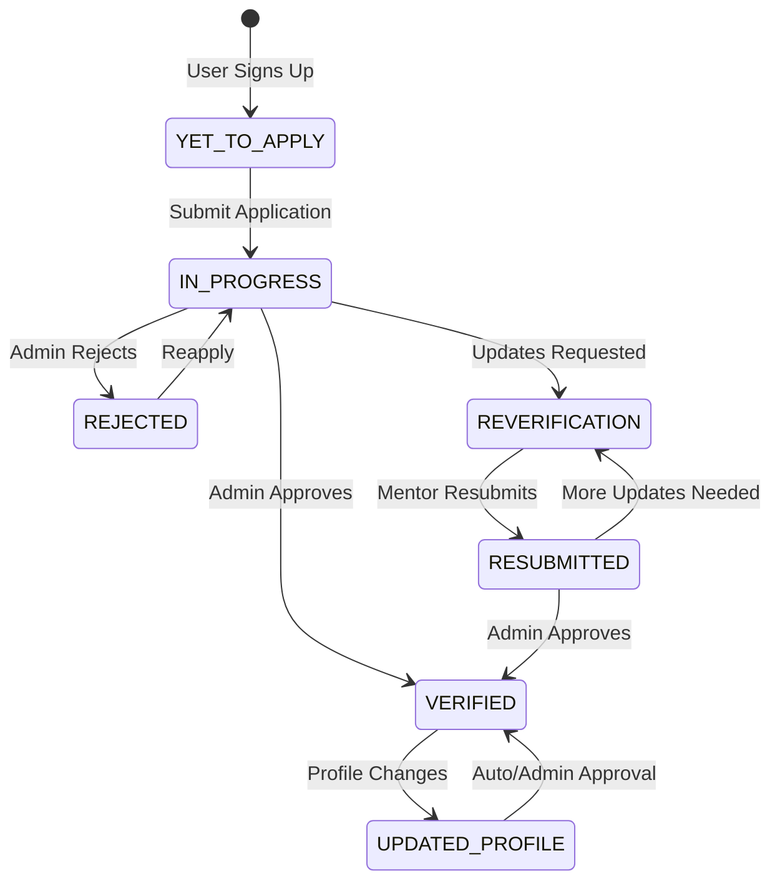

# Mentor Role Documentation

> **Last Updated:** February 5, 2026  
> **Purpose:** Comprehensive documentation of the mentor role, dashboard, actions, and system interactions in SharingMinds.

---

## Table of Contents

1. [Overview](#overview)
2. [Mentor Lifecycle](#mentor-lifecycle)
3. [Database Schema](#database-schema)
4. [Mentor Dashboard](#mentor-dashboard)
5. [Mentor Actions](#mentor-actions)
6. [API Endpoints](#api-endpoints)
7. [Availability System](#availability-system)
8. [Content Management](#content-management)
9. [Session Management](#session-management)
10. [Analytics & Earnings](#analytics--earnings)
11. [Mentor-Mentee Relationships](#mentor-mentee-relationships)
12. [File Structure Reference](#file-structure-reference)

---

## Overview

The **Mentor** role in SharingMinds is one of the primary user types. Mentors are professionals who offer guidance, sessions, and educational content to mentees. The system includes a comprehensive verification workflow, availability management, session booking, content creation, and analytics tracking.

### Key Mentor Capabilities

| Feature | Description |
|---------|-------------|
| Profile Management | Complete professional profile with verification |
| Availability Management | Weekly schedules, exceptions, templates |
| Session Booking | Receive and manage session bookings |
| Content Creation | Create courses, upload files, share URLs |
| Messaging | Direct communication with mentees |
| Analytics | Track earnings, sessions, ratings |
| Reviews | View and respond to mentee reviews |

---

## Mentor Lifecycle



### Verification Status Values

| Status | Description |
|--------|-------------|
| `YET_TO_APPLY` | User has not submitted mentor application |
| `IN_PROGRESS` | Application submitted, pending admin review |
| `VERIFIED` | Admin approved, mentor is active |
| `REJECTED` | Application rejected by admin |
| `REVERIFICATION` | Admin requested changes/updates |
| `RESUBMITTED` | Mentor resubmitted after reverification request |
| `UPDATED_PROFILE` | Verified mentor updated their profile |

---

## Database Schema

### Primary Tables

#### `mentors` Table
**File:** [mentors.ts](file:///c:/Users/Admin/young-minds-landing-page/lib/db/schema/mentors.ts)

```typescript
// Key Fields
id: uuid (PK)
userId: text (FK -> users.id, unique)

// Professional Information
title: text              // e.g., "Senior Software Engineer"
company: text
industry: text
expertise: text          // JSON array of expertise areas
experience: integer      // Years of experience

// Mentoring Details
hourlyRate: decimal(10,2)
currency: text (default 'USD')
availability: text       // JSON for availability schedule
maxMentees: integer (default 10)

// Profile Details
headline: text           // Short professional headline
about: text              // Detailed about section
linkedinUrl, githubUrl, websiteUrl: text

// Registration Fields
fullName, email, phone: text
city, state, country: text
profileImageUrl: text
bannerImageUrl: text     // 4:1 ratio recommended
resumeUrl: text

// Verification & Status
verificationStatus: enum (see above)
verificationNotes: text  // Admin notes
isAvailable: boolean (default true)
paymentStatus: text (default 'PENDING')
couponCode: text
isCouponCodeEnabled: boolean

// Timestamps
createdAt, updatedAt: timestamp
```

#### `mentor_availability_schedules` Table
**File:** [mentor-availability.ts](file:///c:/Users/Admin/young-minds-landing-page/lib/db/schema/mentor-availability.ts)

```typescript
id: uuid (PK)
mentorId: uuid (FK, unique)

// Global Settings
timezone: text (default 'UTC')
defaultSessionDuration: integer (default 60 min)
bufferTimeBetweenSessions: integer (default 15 min)

// Booking Constraints
minAdvanceBookingHours: integer (default 24)
maxAdvanceBookingDays: integer (default 90)

// Business Hours
defaultStartTime: time (default '09:00:00')
defaultEndTime: time (default '17:00:00')

// Flags
isActive: boolean
allowInstantBooking: boolean
requireConfirmation: boolean
```

#### Related Availability Tables

| Table | Purpose |
|-------|---------|
| `mentor_weekly_patterns` | Day-of-week recurring patterns with time blocks |
| `mentor_availability_exceptions` | Holidays, vacations, special dates |
| `availability_templates` | Pre-built schedule templates |
| `mentor_availability_rules` | Custom pricing/booking rules |

#### `mentor_content` Table
**File:** [mentor-content.ts](file:///c:/Users/Admin/young-minds-landing-page/lib/db/schema/mentor-content.ts)

| Table | Purpose |
|-------|---------|
| `mentor_content` | Main content (COURSE, FILE, URL types) |
| `courses` | Course metadata, pricing, difficulty |
| `course_modules` | Modules within courses |
| `course_sections` | Sections within modules |
| `section_content_items` | Individual content items (VIDEO, PDF, DOCUMENT, URL, TEXT) |

#### `sessions` Table
**File:** [sessions.ts](file:///c:/Users/Admin/young-minds-landing-page/lib/db/schema/sessions.ts)

Key session fields for mentors:
- `mentorId`, `menteeId`: Participants
- `status`: 'scheduled', 'in_progress', 'completed', 'cancelled', 'no_show'
- `scheduledAt`, `startedAt`, `endedAt`, `duration`
- `rate`, `currency`: Pricing
- `mentorNotes`: Session notes by mentor
- `isReviewedByMentor`: Review tracking
- `rescheduleCount`, `mentorRescheduleCount`: Tracking reschedules
- `wasReassigned`, `reassignedFromMentorId`: Reassignment tracking

---

## Mentor Dashboard

### Dashboard Location
**Route:** `/dashboard` (for verified mentors)  
**Component:** [mentor-only-dashboard.tsx](file:///c:/Users/Admin/young-minds-landing-page/components/mentor/dashboard/mentor-only-dashboard.tsx)

### Sidebar Navigation
**Component:** [mentor-sidebar.tsx](file:///c:/Users/Admin/young-minds-landing-page/components/mentor/sidebars/mentor-sidebar.tsx)

| Section | Icon | Key | Description |
|---------|------|-----|-------------|
| Dashboard | LayoutDashboard | `dashboard` | Overview with stats and quick actions |
| My Mentees | Users | `mentees` | List and manage mentees |
| Schedule | Calendar | `schedule` | View upcoming sessions calendar |
| Availability | CalendarClock | `availability` | Manage availability settings |
| Messages | MessageSquare | `messages` | Message inbox (with unread badge) |
| Earnings | DollarSign | `earnings` | Revenue tracking |
| Reviews | Star | `reviews` | View mentee reviews |
| Analytics | BarChart3 | `analytics` | Detailed performance analytics |
| My Content | BookOpen | `content` | Manage courses and content |
| Profile | User | `profile` | Edit mentor profile |
| Settings | Settings | `settings` | Account settings |

### Dashboard Stats (Sidebar Header Display)
- **Total Mentees** count
- **Average Rating** display

### Dashboard Components

#### Main Dashboard View
**File:** [mentor-dashboard.tsx](file:///c:/Users/Admin/young-minds-landing-page/components/mentor/dashboard/mentor-dashboard.tsx)

Displays for **non-verified** mentors:
- Verification status card with appropriate messaging
- Application submission/resubmission prompts
- Status-specific actions and guidance

#### Mentor-Only Dashboard
**File:** [mentor-only-dashboard.tsx](file:///c:/Users/Admin/young-minds-landing-page/components/mentor/dashboard/mentor-only-dashboard.tsx)

For **verified** mentors, shows:
- KPI cards (sessions, earnings, rating)
- Recent sessions list
- Pending reviews indicator
- Quick action buttons
- Analytics section

---

## Mentor Actions

### 1. Profile Management

#### Edit Profile
**Component:** [mentor-profile-edit.tsx](file:///c:/Users/Admin/young-minds-landing-page/components/mentor/dashboard/mentor-profile-edit.tsx)

**Actions:**
- Update personal information (name, email, phone, location)
- Upload/change profile picture
- Upload/change banner image (4:1 aspect ratio)
- Upload/update resume
- Edit professional details (title, company, industry)
- Update expertise areas
- Set hourly rate and currency
- Write headline and about sections
- Add social links (LinkedIn, GitHub, website)
- Toggle availability status

**Profile Completion Tracking:** The component calculates completion percentage based on filled fields.

#### View Profile
**Component:** [mentor-profile.tsx](file:///c:/Users/Admin/young-minds-landing-page/components/mentor/dashboard/mentor-profile.tsx)

### 2. Availability Management

**Component:** [mentor-availability-manager.tsx](file:///c:/Users/Admin/young-minds-landing-page/components/mentor/availability/mentor-availability-manager.tsx)

**Sub-Components:**
| Component | Purpose |
|-----------|---------|
| `weekly-schedule-editor.tsx` | Edit weekly recurring schedule |
| `availability-settings.tsx` | Configure global availability settings |
| `availability-exceptions.tsx` | Add holidays, time-off, special dates |
| `availability-templates.tsx` | Apply and save schedule templates |

**Actions:**
- Set timezone
- Configure session duration and buffer time
- Set booking constraints (min/max advance booking)
- Enable/disable weekly day patterns
- Add time blocks per day (AVAILABLE, BREAK, BUFFER, BLOCKED)
- Create exceptions for specific dates
- Save and apply templates
- Reset to defaults

### 3. Session Management

**Mentor can:**
- View upcoming sessions
- Join video sessions (LiveKit integration)
- Cancel sessions (triggers auto-reassignment to another mentor)
- Mark sessions as no-show
- Add mentor notes to sessions
- Review sessions post-completion
- Respond to reschedule requests from mentees

### 4. Content Creation

**Components:** Located in `components/mentor/content/`

| Component | Purpose |
|-----------|---------|
| `content.tsx` | Main content management view |
| `create-course-dialog.tsx` | Create new course |
| `course-builder.tsx` | Build course structure |
| `create-module-dialog.tsx` | Add modules to courses |
| `create-section-dialog.tsx` | Add sections to modules |
| `create-content-item-dialog.tsx` | Add content items |
| `edit-content-dialog.tsx` | Edit existing content |
| `video-preview-dialog.tsx` | Preview uploaded videos |

**Content Types:**
- **COURSE**: Full structured course with modules/sections
- **FILE**: Direct file uploads
- **URL**: External resource links

**Content Item Types:**
- VIDEO, PDF, DOCUMENT, URL, TEXT

### 5. Mentee Management

**Component:** [mentor-mentees.tsx](file:///c:/Users/Admin/young-minds-landing-page/components/mentor/dashboard/mentor-mentees.tsx)

- View list of mentees
- See mentee session history
- Track relationship status
- Message mentees directly

### 6. Analytics & Insights

**Component:** [mentor-analytics-section.tsx](file:///c:/Users/Admin/young-minds-landing-page/components/mentor/dashboard/mentor-analytics-section.tsx)

**Hook:** [use-mentor-analytics.ts](file:///c:/Users/Admin/young-minds-landing-page/hooks/use-mentor-analytics.ts)

**Data Tracked:**
```typescript
interface MentorAnalyticsData {
  kpis: {
    totalCompletedSessions: number
    totalEarnings: number
    periodEarnings: number
    averageRating: number | null
    unreadMessages: number
  }
  earningsOverTime: { month: string; earnings: number }[]
  upcomingSessions: { sessionId, menteeName, title, scheduledAt }[]
  recentReviews: { reviewId, menteeName, rating, feedback }[]
}
```

---

## API Endpoints

### Mentor Profile APIs

| Method | Endpoint | Description |
|--------|----------|-------------|
| GET | `/api/mentors` | Get all verified, available mentors |
| POST | `/api/mentors` | Create mentor profile (basic) |
| GET | `/api/mentors/[id]` | Get mentor details by ID |
| POST | `/api/mentors/apply` | Submit full mentor application |
| PUT | `/api/mentors/update-profile` | Update mentor profile |

### Mentor Dashboard APIs

| Method | Endpoint | Description |
|--------|----------|-------------|
| GET | `/api/mentor/dashboard-stats` | Get dashboard statistics |
| GET | `/api/mentor/recent-sessions` | Get recent sessions |
| GET | `/api/mentor/recent-messages` | Get recent messages |
| GET | `/api/mentor/mentees` | Get mentor's mentees |
| GET | `/api/mentor/mentees-sessions` | Get sessions with mentees |
| GET | `/api/mentor/payments` | Get payment history |

### Availability APIs

| Method | Endpoint | Description |
|--------|----------|-------------|
| GET | `/api/mentors/[id]/availability` | Get mentor availability |
| PUT | `/api/mentors/[id]/availability` | Update availability |
| GET | `/api/mentors/[id]/availability/exceptions` | Get exceptions |
| POST | `/api/mentors/[id]/availability/exceptions` | Add exception |
| DELETE | `/api/mentors/[id]/availability/exceptions/[exceptionId]` | Delete exception |

### Content APIs

| Method | Endpoint | Description |
|--------|----------|-------------|
| GET | `/api/mentors/content` | Get mentor's content |
| POST | `/api/mentors/content` | Create content |
| PUT | `/api/mentors/content/[id]` | Update content |
| DELETE | `/api/mentors/content/[id]` | Delete content |
| POST | `/api/mentors/content/upload` | Upload content files |
| POST | `/api/mentors/content/modules` | Create module |
| POST | `/api/mentors/content/sections` | Create section |

### Analytics API

| Method | Endpoint | Description |
|--------|----------|-------------|
| GET | `/api/analytics/mentor` | Get mentor analytics (with date range) |

---

## Availability System

### Time Block Types

| Type | Description |
|------|-------------|
| `AVAILABLE` | Open for bookings |
| `BREAK` | Personal break time |
| `BUFFER` | Buffer between sessions |
| `BLOCKED` | Not available |

### Weekly Pattern Structure

```typescript
interface WeeklyPattern {
  dayOfWeek: number        // 0-6 (Sunday-Saturday)
  isEnabled: boolean
  timeBlocks: {
    startTime: string      // "09:00"
    endTime: string        // "12:00"
    type: 'AVAILABLE' | 'BREAK' | 'BUFFER' | 'BLOCKED'
    maxBookings?: number
  }[]
}
```

### Exception Types

- Full-day exceptions (vacations, holidays)
- Partial-day exceptions with specific time blocks
- Custom date ranges

### Special Rules

Mentors can create rules with:
- **Conditions:** Specific days, time ranges, date ranges
- **Actions:** Price multipliers, max bookings, confirmation requirements
- **Priority:** Higher priority rules override lower ones

---

## Content Management

### Course Hierarchy

```
mentor_content (COURSE type)
└── courses (metadata, pricing)
    └── course_modules
        └── course_sections
            └── section_content_items
```

### Content Status Workflow

```
DRAFT → PUBLISHED → ARCHIVED
```

### Course Difficulty Levels

- `BEGINNER`
- `INTERMEDIATE`
- `ADVANCED`

---

## Session Management

### Session Statuses

| Status | Description |
|--------|-------------|
| `scheduled` | Upcoming session |
| `in_progress` | Currently active |
| `completed` | Finished successfully |
| `cancelled` | Cancelled by mentor/mentee |
| `no_show` | Participant didn't show up |

### Mentor-Specific Session Fields

- `mentorNotes`: Private notes from mentor
- `isReviewedByMentor`: Whether mentor has reviewed
- `mentorRescheduleCount`: Times mentor rescheduled
- `noShowMarkedBy`: Who marked no-show ('mentor' | 'system')

### Auto-Reassignment

When a mentor cancels a session:
1. System finds another available mentor
2. Session is reassigned (`wasReassigned: true`)
3. Original mentor ID stored in `reassignedFromMentorId`
4. Mentee is notified of the change
5. `reassignmentStatus` tracks: 'pending_acceptance' | 'accepted' | 'rejected' | 'awaiting_mentee_choice'

---

## Mentor-Mentee Relationships

**Table:** `mentoring_relationships`  
**File:** [mentoring-relationships.ts](file:///c:/Users/Admin/young-minds-landing-page/lib/db/schema/mentoring-relationships.ts)

### Relationship Statuses

| Status | Description |
|--------|-------------|
| `pending` | Awaiting approval |
| `active` | Ongoing mentorship |
| `paused` | Temporarily paused |
| `completed` | Mentorship ended successfully |
| `cancelled` | Mentorship cancelled |

### Relationship Features

- **Goals tracking:** What mentee wants to achieve
- **Duration:** Expected mentorship duration
- **Frequency:** Meeting frequency
- **Billing type:** per_session, monthly, package
- **Progress & Milestones:** JSON tracking
- **Dual approval:** Both mentor and mentee must approve

---

## File Structure Reference

### Components

```
components/mentor/
├── availability/
│   ├── availability-exceptions.tsx
│   ├── availability-settings.tsx
│   ├── availability-templates.tsx
│   ├── mentor-availability-manager.tsx
│   └── weekly-schedule-editor.tsx
├── content/
│   ├── content.tsx
│   ├── course-builder.tsx
│   ├── create-content-dialog.tsx
│   ├── create-content-item-dialog.tsx
│   ├── create-course-dialog.tsx
│   ├── create-module-dialog.tsx
│   ├── create-section-dialog.tsx
│   ├── edit-content-dialog.tsx
│   ├── edit-item-dialog.tsx
│   └── video-preview-dialog.tsx
├── dashboard/
│   ├── mentee-card.tsx
│   ├── mentor-analytics-section.tsx
│   ├── mentor-dashboard.tsx
│   ├── mentor-mentees.tsx
│   ├── mentor-only-dashboard.tsx
│   ├── mentor-payment-gate.tsx
│   ├── mentor-profile-edit.tsx
│   ├── mentor-profile.tsx
│   └── session-mentee-card.tsx
└── sidebars/
    └── mentor-sidebar.tsx
```

### API Routes

```
app/api/
├── mentor/
│   ├── dashboard-stats/
│   ├── mentees/
│   ├── mentees-sessions/
│   ├── payments/
│   ├── recent-messages/
│   └── recent-sessions/
└── mentors/
    ├── [id]/
    │   └── availability/
    ├── application/
    ├── apply/
    ├── content/
    │   ├── [id]/
    │   ├── modules/
    │   ├── sections/
    │   └── upload/
    ├── route.ts
    └── update-profile/
```

### Database Schemas

```
lib/db/schema/
├── mentors.ts
├── mentor-availability.ts
├── mentor-content.ts
├── mentoring-relationships.ts
├── mentors-form-audit-trail.ts
├── mentors-profile-audit.ts
└── sessions.ts
```

### Hooks

```
hooks/
├── use-mentor-analytics.ts
├── use-mentor-dashboard.ts
├── use-mentor-detail.ts
├── use-mentor-mentees.ts
├── use-mentor-mentees-sessions.ts
└── queries/
    └── use-mentor-queries.ts
```

---

## Related Documentation

- [Booking System](./booking-system.md) - Session booking and cancellation flows
- [Mentor Profile System](./mentor-profile-system.md) - Profile management details
- [Mentor-Mentee Interactions](./mentor-mentee-interactions-and-subscriptions.md) - Relationship details
- [Admin Role](./admin-role.md) - Admin management of mentors

---

## Change Log

| Date | Changes |
|------|---------|
| 2026-02-05 | Initial comprehensive documentation created |
